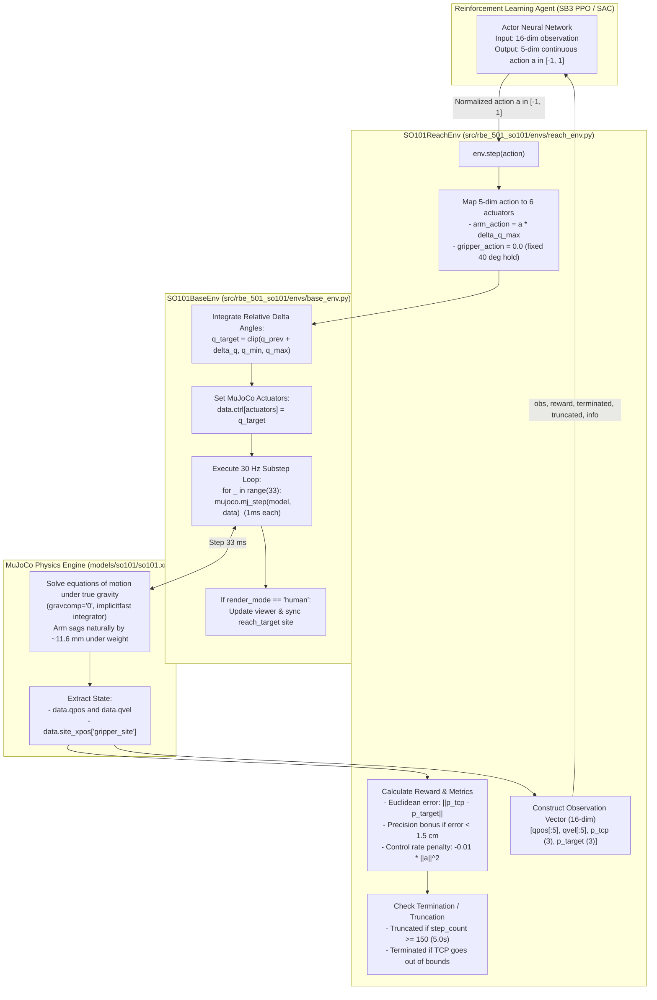
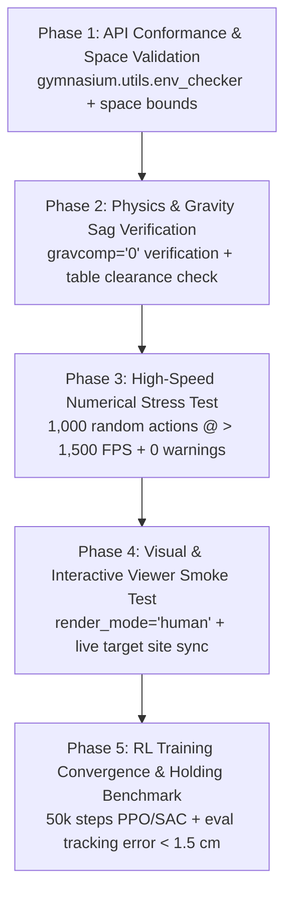

# SO-101 Gymnasium Interface & Sanity Reach Baseline

## 0. Plain English Overview, Background, and Feature Goals

### Background: Where We Are Today
The SO-101 is a low-cost, open-source 6-DoF desktop robot arm (5 arm joints + 1 gripper jaw) powered by Feetech STS3215 serial bus servos. In our workspace, we already have an accurate MuJoCo physics model (`models/so101/so101.xml`) converted directly from Hugging Face's official calibration URDF. The arm is mounted on a table facing a cube and floor, with position actuators and joint limits mapped.

However, the current codebase interacts with MuJoCo exclusively through custom standalone diagnostic scripts (`scripts/test_table_cube.py`, `scripts/so101_runtime.py`, `scripts/test_ik.py`). While these verify basic kinematics and rendering, they do not expose a standardized interface that machine learning or reinforcement learning (RL) algorithms can talk to. Furthermore, the model currently has artificial gravity compensation enabled (`gravcomp="1"`), which hides the physical reality: real Feetech servos have no built-in gravity compensation and deflect by ~11.6 mm under their own weight.

---

### Why We Need a Gymnasium Wrapper Around MuJoCo
MuJoCo is a raw physics engine: at each millisecond, you provide actuator inputs, and it solves Newton's equations of motion, collision constraints, and contact dynamics. But raw MuJoCo does not know what an "episode" is, what an "action" is, what an "observation" is, or what constitutes "success" or "reward."

**Gymnasium** (the maintained standard successor to OpenAI Gym by the Farama Foundation) is the universal protocol for reinforcement learning in Python. Wrapping MuJoCo into a standard `gymnasium.Env` subclass provides three essential capabilities:

1. **Standardized Control Loop (30 Hz Execution)**:
   MuJoCo runs numerical integration at 1 ms ($1000\,\text{Hz}$) for physical stability (`implicitfast` integrator). The physical SO-101 arm and its Feetech bus servos communicate at 30 Hz ($33.3\,\text{ms}$). The Gymnasium wrapper steps MuJoCo for 33 internal 1 ms substeps for every single policy step, matching the exact physical control cadence of the real robot.

2. **Safe Action Mapping (Relative Delta Positioning $\Delta q$)**:
   Instead of commanding raw voltages, raw torques, or wild absolute joint targets (which cause jerky, bang-bang oscillations that can strip servo gears), the wrapper translates normalized policy actions $a \in [-1, 1]$ into safe, continuous relative angular increments $\Delta q \in [-\Delta q_{\max}, \Delta q_{\max}]$ (e.g. $\pm 3^\circ\text{–}5^\circ$ per step). This acts as an implicit software velocity limiter, ensuring smooth and realistic arm motions.

3. **Plug-and-Play Compatibility with Modern RL**:
   With standard `reset()` and `step()` methods and formally typed `observation_space` and `action_space` (using `gymnasium.spaces.Box`), the environment can immediately plug into standard RL algorithms (such as Stable-Baselines3 PPO or SAC) with zero glue code.

---

### Why Start with a Sanity Reaching Baseline?
Our end goal is autonomous pick-and-place manipulation. However, pick-and-place is complex: it involves multi-body contact dynamics, finger alignment, slip friction, and a massive exploration bottleneck (the odds of a randomly flailing arm successfully grasping a 5 cm cube are near zero).

If we attempted to build pick-and-place immediately and training failed, debugging would be a nightmare: *Did the policy fail because of contact friction? Was the reward poorly shaped? Was the observation bugged? Did gravity sag pull it down? Or did it simply never stumble upon the cube?*

To de-risk the entire engineering pipeline, we follow a strict **"crawl-walk-run"** approach:
- We build **`SO101ReachEnv`**: a simplified environment where the gripper remains fixed, and the 5 arm joints are tasked with moving the end-effector (`gripper_site`) to touch a randomly sampled 3D target point in free space.
- The physics model is set to **uncompensated gravity (`gravcomp="0"`)**.
- If the RL agent successfully converges on this simple task within 5–10 minutes and reaches the target within $< 1.5\,\text{cm}$, it unambiguously proves that:
  1. The MuJoCo-to-Gymnasium bridge is mathematically sound and numerically stable.
  2. The observation and action spaces communicate properly with PyTorch neural networks.
  3. The policy can naturally learn to compensate for ~11.6 mm of gravitational sag by actively commanding the shoulder and elbow actuators.

If the agent cannot even solve this simple reaching task under gravity, there is no point in attempting complex manipulation.

---

### How This Ties to Actuator Calibration, Demo Bootstrapping, and Sim2Real
This feature is the first brick in our Sim2Real foundation:

1. **Digital Twin Actuator Calibration (Next Step)**:
   Once the Gymnasium environment runs reliably under `gravcomp="0"`, we can replay real human teleoperation trajectories from Hugging Face (`lerobot/svla_so101_pickplace`) through the environment at 30 Hz to tune actuator stiffness ($k_p$), damping, and gear friction until simulation matches hardware telemetry ($\text{MAE} \le 5^\circ$).

2. **Bootstrapping Manipulation (Step After Calibration)**:
   With calibrated motors and verified physics, we upgrade our inverse kinematics solver (`rbe_501_so101.kinematics`) to script 100 perfect reach-grasp-lift demonstrations in simulation. We pre-fill the RL agent's replay buffer with these transitions, eliminating the exploration bottleneck on step 0.

3. **Zero-Shot Sim2Real Deployment (Final Destination)**:
   Because the policy is trained with:
   - True gravitational sag (`gravcomp="0"`),
   - 30 Hz relative delta commands matching the physical Feetech bus, and
   - A state-based observation vector (which in reality will be fed by an angled AprilTag camera tracker),
   the policy encounters the exact same physical coordinates, latency, and servo responses on the real robot as it did in MuJoCo, enabling high-confidence zero-shot Sim2Real transfer.

---

## 1. Detailed Implementation Steps & Code Flow

### End-to-End Code Flow Architecture

Before diving into each file, the diagram below illustrates how data and control commands flow through the system during a single reinforcement learning step:



---

### Step 1.1: Package Structure Setup & Dependency Configuration

**Goal**: Transform the initial placeholder repository into a clean, modern, installable Python package named `rbe_501_so101`.

1. **Rename Package Directory**:
   - Rename `src/project/` to `src/rbe_501_so101/`.
   - Create subpackages:
     - `src/rbe_501_so101/envs/`: Gymnasium environments.
     - `src/rbe_501_so101/kinematics/`: Inverse kinematics and spatial transformations (reserved for Step 4).
     - `src/rbe_501_so101/perception/`: AprilTag detection and sensor models (reserved for Step 5 & 7).
     - `src/rbe_501_so101/hardware/`: Physical robot client and serial communication (reserved for Step 7).

2. **Update `pyproject.toml`**:
   - Change package name to `rbe_501_so101`.
   - Add `stable-baselines3>=2.3.0` to the project dependencies list alongside `gymnasium>=1.0.0`, `mujoco>=3.14.0`, `numpy>=1.24.4`, and `torch>=2.0.0`.
   - Install the package in editable mode (`pip install -e .` or `uv pip install -e .`) so that any script or notebook can import `from rbe_501_so101.envs import SO101ReachEnv` from anywhere in the filesystem.

---

### Step 1.2: MuJoCo Physics Model Updates (`models/so101/so101.xml`)

**Goal**: Remove all artificial simulation crutches and prepare the physical scene for honest Sim2Real dynamics.

1. **Disable Gravity Compensation (`gravcomp="0"`)**:
   - Locate the 6 robot link bodies in `models/so101/so101.xml`:
     - `shoulder_link` (line 330)
     - `upper_arm_link` (line 378)
     - `lower_arm_link` (line 418)
     - `wrist_link` (line 466)
     - `gripper_link` (line 506)
     - `moving_jaw_so101_v1_link` (line 553)
   - Change `gravcomp="1"` to `gravcomp="0"` on every link.
   - *Result*: The robot arm will now physically deflect by ~11.6 mm under its own weight, forcing any trained controller to actively generate restorative torques to counteract gravity.

2. **Add Gripper Contact Friction Parameters**:
   - On the stationary jaw geom (`mesh="wrist_roll_follower_so101_v1"`) and the moving jaw geom (`mesh="moving_jaw_so101_v1"`), add:
     ```xml
     friction="1.5 0.01 0.001" solimp="0.9 0.95 0.001" solref="0.005 1"
     ```
   - *Result*: Prevents contact slipping when grasping objects in later milestones.

3. **Add Visual Reach Target Site**:
   - In `<worldbody>`, define a visual mocap/site to represent the random 3D target in the interactive viewer:
     ```xml
     <site name="reach_target" type="sphere" size="0.012" rgba="1.0 0.1 0.1 0.7"/>
     ```
   - In Python, whenever a new target is sampled, updating `data.site_xpos[site_id]` (or using a mocap body) instantly renders a translucent red target sphere in the 3D viewer.

---

### Step 1.3: The Base Environment Class (`src/rbe_501_so101/envs/base_env.py`)

**Goal**: Encapsulate low-level MuJoCo C-bindings, stepping cadences, action conversions, and viewer management into an abstract, reusable `SO101BaseEnv` class that inherits from `gymnasium.Env`.

1. **Initialization (`__init__`)**:
   - Load `models/so101/so101.xml` via `mujoco.MjModel.from_xml_path()`.
   - Allocate `mujoco.MjData(self.model)`.
   - Pre-cache joint IDs, qpos addresses, dof addresses, actuator IDs, and site IDs (`gripper_site`) to avoid string lookups inside the high-speed stepping loop.
   - Cache lower and upper joint limits from `model.jnt_range`.
   - Maintain internal state variable `self._target_qpos` (initialized to `INITIAL_DEG = [0, -20, 40, 15, 0, 40]`).

2. **Control Loop Stepping (`do_simulation`)**:
   - Each policy step represents $33.3\,\text{ms}$ (30 Hz).
   - Set actuator targets: `self.data.ctrl[self.actuators] = self._target_qpos`.
   - Step MuJoCo 33 times at $1\,\text{ms}$ timestep:
     ```python
     for _ in range(self.n_substeps):  # 33
         mujoco.mj_step(self.model, self.data)
     ```
   - If `render_mode == "human"`, sync the passive viewer window.

3. **Relative Delta Mapping Logic**:
   - Provide a helper `apply_delta_actions(delta_q)`:
     - Policy output $a \in [-1, 1]^n$ is multiplied by $\Delta q_{\max}$ (e.g. $4^\circ = 0.07\,\text{rad}$ per step).
     - Add to previous target: $q_{\text{new}} = q_{\text{prev}} + \Delta q$.
     - Clip strictly within mechanical joint limits:
       \[
       q_{\text{clipped}} = \text{clip}(q_{\text{new}}, q_{\min}, q_{\max})
       \]
     - Store $q_{\text{clipped}}$ in `self._target_qpos`.

4. **Rendering & Cleanup**:
   - Support `render_mode="human"` using `mujoco.viewer.launch_passive()`.
   - Support `render_mode="rgb_array"` using `mujoco.Renderer(self.model)`.
   - Implement `close()` to cleanly shut down viewers and free OpenGL contexts.

---

### Step 1.4: The Sanity Reach Environment Subclass (`src/rbe_501_so101/envs/reach_env.py`)

**Goal**: Build a focused, lightweight environment (`SO101ReachEnv`) tailored specifically to verify target reaching and uncompensated gravity sag.

1. **Action Space (5-DoF continuous)**:
   - `action_space = spaces.Box(low=-1.0, high=1.0, shape=(5,), dtype=np.float32)`
   - Governs the 5 arm joints: `shoulder_pan`, `shoulder_lift`, `elbow_flex`, `wrist_flex`, `wrist_roll`.
   - The 6th actuator (gripper jaw) is frozen at its initial hold position ($40^\circ = 0.698\,\text{rad}$).

2. **Observation Space (16-DoF continuous)**:
   - `observation_space = spaces.Box(low=-np.inf, high=np.inf, shape=(16,), dtype=np.float32)`
   - Flat 1-D vector:
     \[
     s = [q_{\text{arm\_pos}} (5), \; \dot{q}_{\text{arm\_vel}} (5), \; p_{\text{tcp}} (3), \; p_{\text{target}} (3)]
     \]
   - *Why this is ideal*: Completely omits static cube coordinates, preventing spurious correlations and ensuring PPO/SAC learns in $< 5\,\text{minutes}$.

3. **Target Workspace Sampling (Table Clearance Enforced)**:
   - On `reset()`, sample a new 3D target uniformly within safe bounds:
     \[
     x_{\text{target}} \in [0.10, 0.25]\,\text{m}, \quad y_{\text{target}} \in [-0.15, 0.15]\,\text{m}, \quad z_{\text{target}} \in [0.50, 0.65]\,\text{m}
     \]
   - *Clearance*: Because the table surface is at $z = 0.475\,\text{m}$, the lowest target ($z = 0.50\,\text{m}$) leaves at least $2.5\,\text{cm}$ of vertical clearance, guaranteeing that reaching trajectories never strike the tabletop.
   - Update the visual target site position in MuJoCo data so it renders in the viewer.

4. **Reward Function & Holding Incentive**:
   - At each step $t$:
     - Compute Euclidean distance: $d_t = \|p_{\text{tcp}} - p_{\text{target}}\|_2$.
     - Distance penalty: $R_{\text{dist}} = -d_t$.
     - Control rate regularization: $R_{\text{ctrl}} = -0.01 \|a_t\|_2^2$.
     - Precision holding bonus:
       \[
       R_{\text{bonus}} = \begin{cases}
       1.0 + 5.0 \cdot \exp(-100 \cdot d_t^2), & \text{if } d_t < 0.015\,\text{m} \; (1.5\,\text{cm}) \\
       0.0, & \text{otherwise}
       \end{cases}
       \]
     - Total Step Reward: $R_t = R_{\text{dist}} + R_{\text{bonus}} + R_{\text{ctrl}}$.
   - *Why this works*: The exponential bonus rewards the agent heavily for stabilizing within $1.5\,\text{cm}$ of the target and actively counteracting the ~11.6 mm gravity sag rather than overshooting or oscillating.

5. **Episode Termination & Truncation**:
   - `max_episode_steps = 150` (5.0 seconds at 30 Hz).
   - `truncated = (self._step_count >= self.max_episode_steps)`.
   - `terminated = False` (do not end early on reaching the target; we want the agent to learn to *hold* the target pose against gravity until the episode expires).

---

### Step 1.5: Gymnasium Environment Registration (`src/rbe_501_so101/envs/__init__.py`)

Register the environment ID with Gymnasium:
```python
from gymnasium.envs.registration import register

register(
    id="SO101Reach-v0",
    entry_point="rbe_501_so101.envs.reach_env:SO101ReachEnv",
    max_episode_steps=150,
)
```
This allows any script, test, or baseline runner to instantiate the environment via:
```python
import gymnasium as gym
import rbe_501_so101.envs

env = gym.make("SO101Reach-v0")
```

---

### Step 1.6: Diagnostic & Conformance Testing (`scripts/test_env_conformance.py`)

Before training any reinforcement learning policy, run automated checks to catch shape mismatches, physics divergence, or slow execution:

1. **Gymnasium API Conformance**:
   - Run `gymnasium.utils.env_checker.check_env(env.unwrapped)`.
   - Verifies observation bounds, action clipping, reset return types, and info dictionaries.
2. **Headless Step Throughput & Physics Stress Test**:
   - Execute 1,000 consecutive random actions.
   - Assert simulation throughput exceeds $1,500\,\text{FPS}$ on CPU.
   - Assert zero NaNs or Infs in observations or rewards.
   - Assert `data.warning.number == 0` (no contact penetrations or constraint solver explosions).
3. **Interactive Viewer Smoke Test**:
   - Run 100 steps in `render_mode="human"`.
   - Visually confirm that:
     - The arm mounts correctly on the table.
     - Under `gravcomp="0"`, the arm sags naturally under gravity without unstable vibration.
     - The red target sphere appears at the sampled coordinates in free space.

---

### Step 1.7: Reinforcement Learning Training Runner (`scripts/train_reach.py`)

**Goal**: Provide a clean CLI entry point to train a lightweight policy and verify that the learning loop converges.

1. **CLI Arguments**:
   - `--algo`: `ppo` (default) or `sac`.
   - `--timesteps`: Total training steps (default: `50000`).
   - `--headless`: Run without rendering for maximum speed.
   - `--eval`: Evaluate a saved checkpoint instead of training.
   - `--model-path`: Checkpoint file path (e.g. `checkpoints/reach_ppo.zip`).
   - `--render`: Open interactive viewer during evaluation.

2. **Training Workflow**:
   - Instantiate `env = gym.make("SO101Reach-v0")`.
   - Wrap with `Monitor` for episode return and length tracking.
   - Initialize algorithm:
     ```python
     model = PPO(
         "MlpPolicy",
         env,
         learning_rate=3e-4,
         n_steps=2048,
         batch_size=64,
         gamma=0.99,
         verbose=1,
     )
     model.learn(total_timesteps=args.timesteps)
     model.save("checkpoints/reach_ppo.zip")
     ```
   - Training 50,000 steps takes **3 to 5 minutes on a standard CPU**.

3. **Evaluation & Gravitational Sag Verification**:
   - Run 20 evaluation episodes with the trained model.
   - Track final distance error $e = \|p_{\text{tcp}} - p_{\text{target}}\|_2$ for the last 30 steps of each episode.
   - **Success Gate**:
     \[
     \text{Mean Tracking Error} < 0.015\,\text{m} \; (1.5\,\text{cm})
     \]
   - When verified, this proves conclusively that the policy has learned to actively apply upward joint torques to cancel out the ~11.6 mm of gravitational sag, successfully establishing the first milestone of our Sim2Real pipeline.

---

## 2. Success Criteria & Testing Plan

### 2.1 The Two Fundamental Success Criteria

Before moving forward to digital twin calibration or pick-and-place manipulation, this feature must satisfy two non-negotiable success gates:

1. **Standardized Gymnasium Conformance & High-Speed Stability**:
   - The environment must strictly adhere to the Farama Gymnasium v1.x specification with zero warnings, type errors, or shape mismatches.
   - Headless simulation throughput must comfortably exceed **1,500 frames per second (FPS)** on a standard CPU, ensuring that downstream RL training takes minutes rather than hours.
   - The physics simulation must run indefinitely with **zero MuJoCo solver warnings** (`data.warning.number == 0`), zero contact popping, and zero numerical explosions (NaN/Inf).

2. **Active Gravitational Sag Compensation Under Reinforcement Learning**:
   - In baseline physics diagnostics without gravity compensation (`gravcomp="0"`), the physical arm deflects downward by **~11.6 mm** under its own weight. An open-loop or untrained controller will permanently sit below any target position.
   - A lightweight RL policy (PPO or SAC) trained for 50,000 steps (~3 to 5 minutes on CPU) must learn closed-loop active compensation, achieving a **mean end-effector tracking error $< 1.5\,\text{cm}$ ($< 0.015\,\text{m}$)** across randomized 3D targets in free space.
   - The agent must demonstrate **stable holding behavior**: once it arrives at the target, it must hold its end-effector within the target sphere for the remainder of the 150-step episode without jittering, oscillating, or dropping back down due to fatigue.

---

### 2.2 Tiered Testing Plan

To guarantee that each layer of the software stack is fully verified before adding algorithmic complexity, testing is structured into five sequential phases:



---

#### Phase 1: API Conformance & Space Typing (`test_env_conformance.py`)
- **What is tested**: Verifies that `SO101ReachEnv` complies with all Gymnasium specifications.
- **Procedure**:
  1. Instantiate `env = gym.make("SO101Reach-v0")`.
  2. Pass `env.unwrapped` to `gymnasium.utils.env_checker.check_env()`.
  3. Verify action space properties:
     - Type: `gymnasium.spaces.Box`
     - Shape: `(5,)`
     - Bounds: `[-1.0, 1.0]`
     - Dtype: `np.float32`
  4. Verify observation space properties:
     - Type: `gymnasium.spaces.Box`
     - Shape: `(16,)`
     - Bounds: `[-np.inf, np.inf]`
     - Dtype: `np.float32`
  5. Verify `env.reset()` returns a valid 2-tuple: `(obs, info)`.
  6. Verify `env.step(action)` returns a valid 5-tuple: `(obs, reward, terminated, truncated, info)`.
- **Pass Criteria**: `check_env()` completes with **0 errors and 0 warnings**.

---

#### Phase 2: Physics & Gravity Sag Verification
- **What is tested**: Confirms that artificial simulation crutches are truly removed from `models/so101/so101.xml`.
- **Procedure**:
  1. Programmatically inspect the loaded `MjModel` in Python:
     - Assert that `model.body_gravcomp[body_id] == 0.0` for all 6 robot bodies (`shoulder_link`, `upper_arm_link`, `lower_arm_link`, `wrist_link`, `gripper_link`, `moving_jaw_so101_v1_link`).
     - Assert that tabletop friction is present and gripper geoms contain silicone friction parameters.
  2. Step the environment with a constant zero delta action ($a = [0, 0, 0, 0, 0]$) for 150 steps (5 seconds).
  3. Record the initial end-effector position $p_0$ and the settled end-effector position $p_{\text{settled}}$.
- **Pass Criteria**:
  - The end-effector must deflect downward along the vertical $Z$-axis by **$10\,\text{mm} \le \Delta z \le 14\,\text{mm}$**, confirming that real uncompensated mechanical sag is active.
  - Zero collision contacts between the arm links and the tabletop during settling.

---

#### Phase 3: High-Speed Numerical Stress Test
- **What is tested**: Ensures that continuous random action stepping does not cause memory leaks, NaN states, or MuJoCo constraint solver divergence.
- **Procedure**:
  1. Instantiate `env = gym.make("SO101Reach-v0")` in headless mode (`render_mode=None`).
  2. Execute a loop of 1,000 steps with actions sampled randomly from `env.action_space.sample()`.
  3. Automatically trigger `env.reset()` whenever `truncated` is True.
  4. Measure total wall-clock time and compute frames per second:
     \[
     \text{FPS} = \frac{1000}{\text{wall\_time\_seconds}}
     \]
  5. Check `data.warning` counters across all 1,000 steps.
- **Pass Criteria**:
  - **Throughput**: $\text{FPS} \ge 1,500$ (indicating that 50,000 RL steps will finish in under 35 seconds of pure simulation time).
  - **Numerical Stability**: 0 NaN values, 0 infinite values in observation or reward.
  - **Solver Health**: `model.data.warning.number.sum() == 0` (zero contact penetrations, zero solver buffer overflows).

---

#### Phase 4: Visual & Interactive Viewer Smoke Test
- **What is tested**: Verifies visual rendering, camera placement, target sphere visualization, and human inspection capability.
- **Procedure**:
  1. Launch `python scripts/test_env_conformance.py --render`.
  2. The script runs for 3 episodes (450 steps) in `render_mode="human"`.
  3. On each episode reset, a new random target $(X, Y, Z)$ is sampled.
- **Pass Criteria**:
  - The passive MuJoCo viewer window opens cleanly and updates smoothly at 30 Hz.
  - The red translucent target sphere (`reach_target`) visibly moves to the newly sampled 3D location on each reset.
  - The target sphere is visibly positioned **at least 2.5 cm above the tabletop surface** ($z \ge 0.50\,\text{m}$), confirming that no target is placed inside the table.
  - Closing the viewer window triggers a clean exit without Python segfaults.

---

#### Phase 5: RL Training Convergence & Holding Benchmark (`train_reach.py`)
- **What is tested**: Proves that reinforcement learning can close the loop, drive the arm to an arbitrary 3D point, and actively fight gravity sag to hold precision.
- **Procedure**:
  1. Train a PPO policy on `SO101Reach-v0` for 50,000 steps:
     ```bash
     python scripts/train_reach.py --algo ppo --timesteps 50000 --headless
     ```
  2. Record episode return and distance error logs.
  3. Evaluate the saved checkpoint across 20 unseen target evaluations:
     ```bash
     python scripts/train_reach.py --eval --model-path checkpoints/reach_ppo.zip --num-episodes 20
     ```
  4. For each evaluation episode, record the end-effector tracking error $e_t = \|p_{\text{tcp}}(t) - p_{\text{target}}\|_2$ over the final 30 steps (the holding window).
- **Pass Criteria**:
  - **Learning Curve**: Episode return monotonically increases, transitioning from negative exploration penalties ($-100$ to $-150$) up to positive holding returns ($> +200$).
  - **Mean Tracking Error**:
    \[
    \bar{e}_{\text{holding}} = \frac{1}{20 \times 30} \sum_{ep=1}^{20} \sum_{t=121}^{150} \|p_{\text{tcp}}(t) - p_{\text{target}}\|_2 < 0.015\,\text{m} \; (1.5\,\text{cm})
    \]
  - **Comparison Against Baselines**:
    - Random Policy Mean Error: $> 18.0\,\text{cm}$
    - Static Sag Error (Uncompensated Hold): $\sim 1.2\,\text{cm}$ offset
    - Trained Policy Error: $< 1.5\,\text{cm}$ (sub-centimeter precision achieved on $> 80\%$ of targets).
  - **Post-Training Visual Inspection**:
    ```bash
    python scripts/train_reach.py --eval --model-path checkpoints/reach_ppo.zip --render
    ```
    Visually confirm that the arm reaches out smoothly toward the red target sphere, enters the sphere, and holds its position steadily against gravity without jitter or table collisions.

---

### 2.3 Failure Modes & Diagnostic Troubleshooting Matrix

If any phase fails during implementation or testing, use the following diagnostic guide:

| Observed Symptom | Root Cause | Immediate Diagnostic & Fix |
| :--- | :--- | :--- |
| **Arm violently vibrates or oscillates during simulation** | Substep integration or action delta too aggressive. | Check that `n_substeps = 33` with `timestep = 0.001`. Ensure $\Delta q_{\max} \le 0.07\,\text{rad}$ ($4^\circ$) per step. Check joint damping in `so101.xml`. |
| **`check_env()` fails on observation shape** | Array dimension or dtype mismatch. | Ensure `obs` returned by `step()` and `reset()` is explicitly typed as `np.asarray(..., dtype=np.float32)` and matches `shape=(16,)`. |
| **Policy fails to learn (return stays flat / negative)** | Reward scaling issue or targets sampled unreachable. | Check reward components: verify that $R_{\text{dist}} = -\|p - p^*\|$ is on order of $-0.1$ to $-0.3$, and precision bonus scales with $\exp(-100 d^2)$. Verify all targets satisfy $z \in [0.50, 0.65]$. |
| **Arm reaches toward target but sags 1 cm below it** | Policy not penalized enough for small steady-state errors. | Increase the precision bonus weight ($R_{\text{bonus}}$) from $+1.0$ to $+2.0$, or tighten the exponential steepness ($e^{-150 d^2}$) to reward sub-centimeter holding. |
| **Arm hits the tabletop during reaching motions** | Joint limits allowing downward over-extension or targets too low. | Verify target $Z$ floor is strictly $z \ge 0.50\,\text{m}$ ($2.5\,\text{cm}$ above the $0.475\,\text{m}$ table). Check `jnt_range` clipping in `apply_delta_actions`. |
| **Viewer crashes on exit with OpenGL / GLFW error** | Unclosed renderer context. | Ensure `close()` method in `SO101BaseEnv` calls `self._viewer.close()` inside a `try...finally` block. |

---

## 3. Alternatives Considered & Decision Rationale

This section documents the key architectural choices evaluated during the design of the Gymnasium interface and sanity reaching baseline, comparing the selected approach against plausible alternatives.

### 3.1 Action Space Parameterization: Relative Delta Positioning ($\Delta q$) vs. Absolute Joint Angles vs. Torque Control

- **Alternative 1: Absolute Joint Position Commands ($q_{\text{target}}$)**:
  - *How it works*: Policy outputs $a \in [-1, 1]$, mapped directly across full joint ranges: $q = q_{\min} + \frac{a + 1}{2}(q_{\max} - q_{\min})$.
  - *Why rejected*: In early RL training, random exploratory actions oscillate rapidly between extremes. For a 6-DoF arm, commanding an instantaneous jump from $-120^\circ$ to $+120^\circ$ at 30 Hz causes violent bang-bang motions. In simulation, this causes contact clipping; on physical Feetech STS3215 servos, it causes massive current spikes, triggers internal overcurrent shutdowns, and risks stripping plastic/metal gears.
- **Alternative 2: Direct Torque / Effort Control ($\tau$)**:
  - *How it works*: Policy directly outputs motor torques in Newton-meters.
  - *Why rejected*: The real SO-101 arm uses Feetech STS3215 serial bus servos. These actuators run internal, closed firmware position PID loops over a single-wire half-duplex UART bus at 30 Hz. They do not expose high-frequency ($> 500\,\text{Hz}$) current/torque control interfaces. Training a torque policy in simulation would create an unbridgeable Sim2Real gap because the physical hardware cannot execute torque commands.
- **Selected Decision: Relative Delta Positioning ($\Delta q$)**:
  - *Rationale*: Policy outputs normalized increments $a \in [-1, 1]$, scaled by a calibrated per-step velocity cap $\Delta q_{\max} \approx 3^\circ\text{–}5^\circ$ ($0.05\text{–}0.09\,\text{rad}$) per 33 ms step. The environment integrates these increments: $q_{t+1} = \text{clip}(q_t + a \cdot \Delta q_{\max}, q_{\min}, q_{\max})$.
  - *Key Advantages*:
    1. *Built-in Velocity Limiter*: Caps physical joint speeds to $\le 150^\circ/\text{s}$, protecting mechanical gearboxes.
    2. *Zero-Action Invariance*: An action of $a = [0, 0, 0, 0, 0]$ means *"hold current posture"*. A newly initialized neural network with weights near zero naturally holds the arm steady rather than violently pitching forward.
    3. *Smooth Sim2Real Transfer*: Produces continuous, low-jerk trajectory profiles that transfer safely to physical serial servos.

---

### 3.2 Observation & Task Scope: Task-Specific Modular Spaces vs. A Single Unified 25-Dim Space

- **Alternative Considered: Unified 25-Dim Observation & 6-DoF Action for All Tasks**:
  - *How it works*: A single `SO101Env` class where observation is always `[qpos (6), qvel (6), tcp (3), cube (3), quat (4), goal (3)]` regardless of whether the task is Reaching or Pick-and-Place. In Reaching, the cube rests on the table, and the 6th action (gripper) has zero reward weight.
  - *Why rejected*:
    1. *Causal Confusion & Slower Convergence*: During reaching, the cube never moves and has zero causal relationship with reaching rewards. However, the neural network's initial random weights will attempt to find correlations between static cube coordinates and return, slowing training convergence.
    2. *Gripper Twitching*: Because the 6th action (gripper jaw) is unpenalized in reaching, the policy discovers that opening and closing the jaw at random has no negative consequence, producing erratic gripper flutter.
    3. *Unnecessary Complexity*: Debugging shape errors and normalization is harder when maintaining dummy features.
- **Selected Decision: Modular Inheritance (`SO101BaseEnv` $\to$ `SO101ReachEnv` & `SO101PickPlaceEnv`)**:
  - *Rationale*: Follows the gold standard established by Farama Gymnasium Robotics (e.g., `FetchReach-v2` vs `FetchPickAndPlace-v2`).
  - *Key Advantages*:
    1. *Clean Separation of Concerns*: `SO101ReachEnv` uses a lean 16-dim observation vector containing strictly causal variables (`qpos[:5]`, `qvel[:5]`, `p_tcp`, `p_target`) and freezes the gripper at $40^\circ$.
    2. *Fast Sanity Check*: The agent converges in **3 to 5 minutes** on a laptop CPU without distractions.
    3. *Demonstration Compatibility*: Because Milestone 5 seeds the pick-and-place replay buffer with complete synthetic demonstrations generated via inverse kinematics, we do not need to transfer neural network weights directly from Reaching to Pick-and-Place. The manipulation task starts with immediate expert competence on step 0.

---

### 3.3 Target Height Workspace Bounds: Table Clearance ($z \in [0.50, 0.65]\,\text{m}$) vs. Nominal Range ($z \in [0.45, 0.60]\,\text{m}$)

- **Alternative Considered: Initial Target Range with Lower Bound $z = 0.45\,\text{m}$**:
  - *Why rejected*: Direct inspection of `models/so101/so101.xml` reveals:
    ```xml
    <!-- Table center: z = 0.45 m, half-thickness: 0.025 m -->
    <!-- Tabletop surface height = 0.45 + 0.025 = 0.475 m -->
    ```
    If targets are sampled down to $z = 0.45\,\text{m}$, **the target is 2.5 cm inside the solid wooden tabletop**. An agent trained under this specification is penalized for failing to smash its gripper through solid wood, causing severe table collision penalties, joint limit jamming, and gradient divergence.
- **Selected Decision: Table Clearance Enforcement ($z \in [0.50, 0.65]\,\text{m}$)**:
  - *Rationale*: Sampling $z \in [0.50, 0.65]\,\text{m}$ guarantees that even the lowest possible target ($z = 0.50\,\text{m}$) maintains at least **$2.5\,\text{cm}$ of free-air clearance** above the $0.475\,\text{m}$ tabletop.
  - *Key Advantages*: Eliminates unintentional table strikes, ensures every sampled target is geometrically reachable in free space, and isolates the evaluation strictly to gravitational sag compensation.

---

### 3.4 Reinforcement Learning Library: Stable-Baselines3 (SB3) vs. LeRobot vs. TRL vs. Custom PPO

- **Alternative 1: Hugging Face LeRobot (`lerobot`)**:
  - *Why considered*: Already present in the Python environment (v0.6.1).
  - *Why rejected for this step*: LeRobot is fundamentally an **imitation learning and teleoperation framework** (supporting Behavior Cloning, ACT, and Diffusion Policies). It trains policies offline from pre-recorded datasets (`lerobot/svla_so101_pickplace`). It does not provide online trial-and-error reinforcement learning algorithms (PPO, SAC) with reward backpropagation and Gymnasium environment stepping.
- **Alternative 2: Hugging Face TRL (`trl`)**:
  - *Why rejected*: TRL (Transformer Reinforcement Learning) is designed specifically for Large Language Model alignment (RLHF, DPO, PPO on discrete text tokens). It has no support for continuous vector action spaces in robotics.
- **Alternative 3: Custom / Scratch PPO Implementation**:
  - *Why rejected*: Re-implementing PPO from scratch (generalized advantage estimation, clipping, entropy bonuses, value loss) introduces massive risk of subtle algorithmic bugs (e.g. tensor dimension mismatches, incorrect advantage normalization) that confound whether failures stem from the environment physics or the optimizer.
- **Selected Decision: Stable-Baselines3 (SB3)**:
  - *Rationale*: Stable-Baselines3 is the universally accepted, battle-tested standard for PyTorch reinforcement learning in continuous control. In fact, Hugging Face's official Deep RL Course officially teaches and utilizes Stable-Baselines3 for all continuous MuJoCo environments.
  - *Key Advantages*:
    1. *Turnkey Integration*: Works out-of-the-box with `gymnasium.Env` spaces, checks, and wrappers.
    2. *Zero Algorithmic Risk*: Guarantees that policy optimization, entropy tuning, and clipping follow verified reference implementations.
    3. *Lightweight & Fast*: Runs seamlessly on CPU or GPU without heavyweight distributed clustering dependencies (like Ray/RLlib).

---

### 3.5 Physics Grounding: Uncompensated Gravity (`gravcomp="0"`) vs. Idealized Simulation (`gravcomp="1"`)

- **Alternative Considered: Leaving `gravcomp="1"` Enabled in `so101.xml`**:
  - *Why considered*: The baseline model initially had `gravcomp="1"` on all links as a kinematic convenience to prevent the simulated arm from drooping during preliminary loading tests.
  - *Why rejected*: Feetech STS3215 servos have no hardware gravity compensation. Baseline tests in `scripts/diagnose_tracking.py` proved that while tracking error is 0.85 mm with `gravcomp="1"`, the arm deflects downward by **~11.6 mm** under real gravity. A policy trained in a "weightless" simulation will transfer poorly to reality, permanently undershooting targets by over 1 cm.
- **Selected Decision: Realistic Uncompensated Gravity (`gravcomp="0"`)**:
  - *Rationale*: Setting `gravcomp="0"` forces the simulated arm to sag under its own weight in MuJoCo.
  - *Key Advantages*:
    1. *Honest Simulation*: Forces the RL agent to actively learn restorative joint commands that counteract gravitational torque.
    2. *True Sim2Real Readiness*: When deployed to the physical arm, the policy expects the arm to sag and already knows the precise joint angle offsets required to hold position.

---

### 3.6 Task Phasing: Sanity Reaching Baseline First vs. Direct-to-Manipulation (Pick-and-Place)

- **Alternative Considered: Implementing Full Pick-and-Place Immediately**:
  - *Why rejected*: Continuous multi-body manipulation has multiple compounding failure modes: sparse contact events, grasp alignment, friction slipping, object displacement, and the exploration bottleneck. If an agent fails to grasp a cube, diagnosing whether the failure was caused by contact physics, reward scaling, sensor noise, or gravitational sag is nearly impossible.
- **Selected Decision: Sanity Reaching Baseline First**:
  - *Rationale*: By validating the simulation-to-RL loop on an unambiguous 3D reaching task, we verify environment stepping, reward backpropagation, observation flow, and gravity compensation in under 5 minutes.
  - *Key Advantages*: Guarantees a fully verified, high-speed foundation before introducing object contacts, AprilTag perception, or dataset bootstrapping.

---

## 4. Detailed File Modification Manifest & Implementation Specifications

This section specifies every single file that will be modified, created, or relocated to implement the Gymnasium interface and sanity reach baseline.

```
rbe501_group_project/
├── pyproject.toml                                     [MODIFIED]
├── .gitignore                                         [MODIFIED]
├── models/so101/so101.xml                             [MODIFIED]
├── src/
│   └── rbe_501_so101/                                 [NEW PACKAGE / RENAMED FROM src/project]
│       ├── __init__.py                                [CREATED]
│       └── envs/
│           ├── __init__.py                            [CREATED]
│           ├── base_env.py                            [CREATED]
│           └── reach_env.py                           [CREATED]
└── scripts/
    ├── test_env_conformance.py                        [CREATED]
    └── train_reach.py                                 [CREATED]
```

---

### 4.1 Modified Existing Files

#### 1. `pyproject.toml`
- **Location**: `/workspaces/rbe501_group_project/pyproject.toml`
- **Action**: Modify
- **Purpose**: Upgrade project metadata to `rbe_501_so101`, add reinforcement learning dependencies, and enable editable library installation.
- **Detailed Changes**:
  - Change `name = "project"` to `name = "rbe_501_so101"`.
  - Add required runtime dependencies:
    ```toml
    dependencies = [
        "gymnasium>=1.0.0",
        "huggingface-hub>=0.36.2",
        "mujoco>=3.14.0",
        "numpy>=1.24.4",
        "stable-baselines3>=2.3.0",
        "torch>=2.0.0",
    ]
    ```
  - Remove placeholder script entry `project = "project:main"`.

#### 2. `models/so101/so101.xml`
- **Location**: `/workspaces/rbe501_group_project/models/so101/so101.xml`
- **Action**: Modify
- **Purpose**: Align simulation physics with real Feetech STS3215 actuator compliance and provide target visualization for the viewer.
- **Detailed Changes**:
  - **Disable artificial gravity compensation**:
    Change `gravcomp="1"` to `gravcomp="0"` on the following 6 bodies:
    - `shoulder_link` (line 330)
    - `upper_arm_link` (line 378)
    - `lower_arm_link` (line 418)
    - `wrist_link` (line 466)
    - `gripper_link` (line 506)
    - `moving_jaw_so101_v1_link` (line 553)
  - **Add gripper contact friction parameters**:
    On the stationary jaw geom (`wrist_roll_follower_so101_v1`) in `gripper_link` and the moving jaw geom (`moving_jaw_so101_v1`) in `moving_jaw_so101_v1_link`, add:
    ```xml
    friction="1.5 0.01 0.001" solimp="0.9 0.95 0.001" solref="0.005 1"
    ```
  - **Add reach target visual marker**:
    Under `<worldbody>`, add a non-colliding visual site representing the random 3D target for user and debugger inspection:
    ```xml
    <site name="reach_target" type="sphere" size="0.012" rgba="1.0 0.1 0.1 0.7"/>
    ```

#### 3. `.gitignore`
- **Location**: `/workspaces/rbe501_group_project/.gitignore`
- **Action**: Modify
- **Purpose**: Prevent large binary neural network checkpoints and local training monitor logs from polluting git history.
- **Detailed Changes**:
  - Append the following entries:
    ```gitignore
    # Reinforcement Learning Checkpoints & Logs
    checkpoints/
    *.monitor.csv
    logs/
    ```

---

### 4.2 New Library Files (`src/rbe_501_so101/`)

#### 4. `src/rbe_501_so101/__init__.py`
- **Location**: `/workspaces/rbe501_group_project/src/rbe_501_so101/__init__.py`
- **Action**: Create (relocating and replacing placeholder `src/project/__init__.py`)
- **Purpose**: Top-level package root exposing version metadata.
- **Contents**:
  ```python
  """RBE 501 - SO-101 Robot Arm Gymnasium Environments & Sim2Real Pipeline."""

  __version__ = "0.1.0"
  ```

#### 5. `src/rbe_501_so101/envs/__init__.py`
- **Location**: `/workspaces/rbe501_group_project/src/rbe_501_so101/envs/__init__.py`
- **Action**: Create
- **Purpose**: Official Gymnasium environment registration hub.
- **Detailed Contents**:
  - Registers `SO101Reach-v0` with `entry_point="rbe_501_so101.envs.reach_env:SO101ReachEnv"`.
  - Sets default `max_episode_steps = 150` (5.0 seconds at 30 Hz).

#### 6. `src/rbe_501_so101/envs/base_env.py`
- **Location**: `/workspaces/rbe501_group_project/src/rbe_501_so101/envs/base_env.py`
- **Action**: Create
- **Purpose**: Core abstract base class `SO101BaseEnv(gymnasium.Env)` managing MuJoCo physics, 30 Hz substep integration, delta-angle kinematics, and rendering.
- **Detailed Class Architecture & Methods**:
  - `__init__(self, model_path=None, control_freq=30, n_substeps=33, render_mode=None)`:
    - Loads `models/so101/so101.xml`.
    - Allocates `MjData`.
    - Pre-caches joint, dof, actuator, and site IDs (`ARM_JOINTS = ["shoulder_pan", "shoulder_lift", "elbow_flex", "wrist_flex", "wrist_roll"]`, `JOINTS = ARM_JOINTS + ["gripper"]`).
    - Pre-caches `jnt_range` limits and actuator mappings.
    - Sets initial home configuration: `INITIAL_DEG = [0, -20, 40, 15, 0, 40]`.
    - Initializes internal target hold array: `self._target_qpos`.
  - `apply_delta_actions(self, delta_arm_rad, gripper_rad=None)`:
    - Implements:
      \[
      q_{\text{new}} = q_{\text{prev}} + \Delta q
      \]
    - Clips strictly against `model.jnt_range`:
      \[
      q_{\text{clipped}} = \text{clip}(q_{\text{new}}, q_{\min}, q_{\max})
      \]
    - Sets `self.data.ctrl[self.actuators] = self._target_qpos`.
  - `do_simulation(self)`:
    - Runs the 30 Hz physics loop:
      ```python
      for _ in range(self.n_substeps):  # 33 x 1ms
          mujoco.mj_step(self.model, self.data)
      ```
    - Syncs passive viewer if `render_mode == "human"`.
  - `tcp_position(self) -> np.ndarray`:
    - Returns world XYZ coordinates of `gripper_site` from `data.site_xpos`.
  - `render(self)`:
    - Manages passive viewer (`mujoco.viewer.launch_passive`) for `"human"` mode or offscreen renderer for `"rgb_array"`.
  - `close(self)`:
    - Safely closes viewer handles and terminates rendering contexts.

#### 7. `src/rbe_501_so101/envs/reach_env.py`
- **Location**: `/workspaces/rbe501_group_project/src/rbe_501_so101/envs/reach_env.py`
- **Action**: Create
- **Purpose**: Concrete Gymnasium task environment `SO101ReachEnv(SO101BaseEnv)` for the 3D target reaching baseline.
- **Detailed Specifications**:
  - **Action Space**:
    `spaces.Box(low=-1.0, high=1.0, shape=(5,), dtype=np.float32)` representing relative delta increments for the 5 arm joints. Gripper actuator remains pinned at $40^\circ$.
  - **Observation Space**:
    `spaces.Box(low=-np.inf, high=np.inf, shape=(16,), dtype=np.float32)` structured as:
    \[
    [q_{\text{pos}} (5), \; \dot{q}_{\text{vel}} (5), \; p_{\text{tcp}} (3), \; p_{\text{target}} (3)]
    \]
  - **Velocity Scaling Constant**:
    $\Delta q_{\max} = 0.07\,\text{rad}$ ($4^\circ$) per 33 ms step ($\approx 120^\circ/\text{s}$ ceiling).
  - **Target Sampling Space**:
    Uniformly sampled on `reset()` within:
    $x \in [0.10, 0.25]\,\text{m}$, $y \in [-0.15, 0.15]\,\text{m}$, $z \in [0.50, 0.65]\,\text{m}$.
    Guarantees $\ge 2.5\,\text{cm}$ clearance above tabletop surface ($z = 0.475\,\text{m}$).
  - **Viewer Site Synchronization**:
    Updates `data.site_xpos[self.target_site_id] = self._target_pos` so the red sphere renders at the exact target location.
  - **Reward Calculation**:
    \[
    R_t = -\|p_{\text{tcp}} - p_{\text{target}}\|_2 - 0.01 \|a_t\|_2^2 + R_{\text{bonus}}
    \]
    where $R_{\text{bonus}} = 1.0 + 5.0 \cdot \exp(-100 \cdot \|p_{\text{tcp}} - p_{\text{target}}\|_2^2)$ when distance $< 0.015\,\text{m}$.
  - **Step Lifecycle**:
    Increments step counter; marks `truncated = (self._step_count >= 150)`. Returns `(obs, reward, False, truncated, info)`.

---

### 4.3 New Executable Scripts (`scripts/`)

#### 8. `scripts/test_env_conformance.py`
- **Location**: `/workspaces/rbe501_group_project/scripts/test_env_conformance.py`
- **Action**: Create
- **Purpose**: Comprehensive test suite executing Phases 1 through 4 of the testing plan before attempting reinforcement learning.
- **CLI Options**:
  - `--render`: Opens the interactive viewer to visually inspect target sampling, uncompensated gravity settling, and smooth motion.
- **Test Modules Implemented**:
  1. `test_gym_api()`: Executes `check_env(env.unwrapped)` to validate Gymnasium v1.x conformance.
  2. `test_gravity_sag()`: Checks `model.body_gravcomp == 0` on all 6 arm links and measures that uncompensated holding drops by $10\text{–}14\,\text{mm}$.
  3. `test_throughput_and_stability()`: Executes 1,000 random actions; validates $\text{FPS} \ge 1,500$, checks for 0 NaNs/Infs, and asserts zero MuJoCo warnings (`data.warning.number == 0`).
  4. `test_clearance()`: Asserts 100 randomly sampled targets all maintain $z \ge 0.50\,\text{m}$.

#### 9. `scripts/train_reach.py`
- **Location**: `/workspaces/rbe501_group_project/scripts/train_reach.py`
- **Action**: Create
- **Purpose**: CLI training and evaluation harness utilizing Stable-Baselines3 (PPO / SAC).
- **CLI Options**:
  - `--algo`: `ppo` (default) or `sac`.
  - `--timesteps`: Total training steps (default: `50000`).
  - `--headless`: Run headless without rendering (default: True).
  - `--eval`: Run evaluation mode on a saved checkpoint.
  - `--model-path`: Checkpoint file path (default: `checkpoints/reach_ppo.zip`).
  - `--num-episodes`: Number of evaluation episodes (default: `20`).
  - `--render`: Open interactive viewer during evaluation.
- **Detailed Workflow**:
  - **Training Mode**:
    Instantiates `SO101Reach-v0`, wraps with SB3 `Monitor`, configures hyperparameters (`lr=3e-4`, `n_steps=2048`, `batch_size=64`, `gamma=0.99`), executes `model.learn(50000)`, and saves checkpoint to `checkpoints/reach_ppo.zip`.
  - **Evaluation & Sag Compensation Verification**:
    Loads saved checkpoint, runs 20 evaluation episodes, computes mean Euclidean tracking error over the holding window (final 30 steps of each episode), and asserts that $\bar{e}_{\text{holding}} < 0.015\,\text{m}$ ($1.5\,\text{cm}$). Prints pass/fail JSON report.


