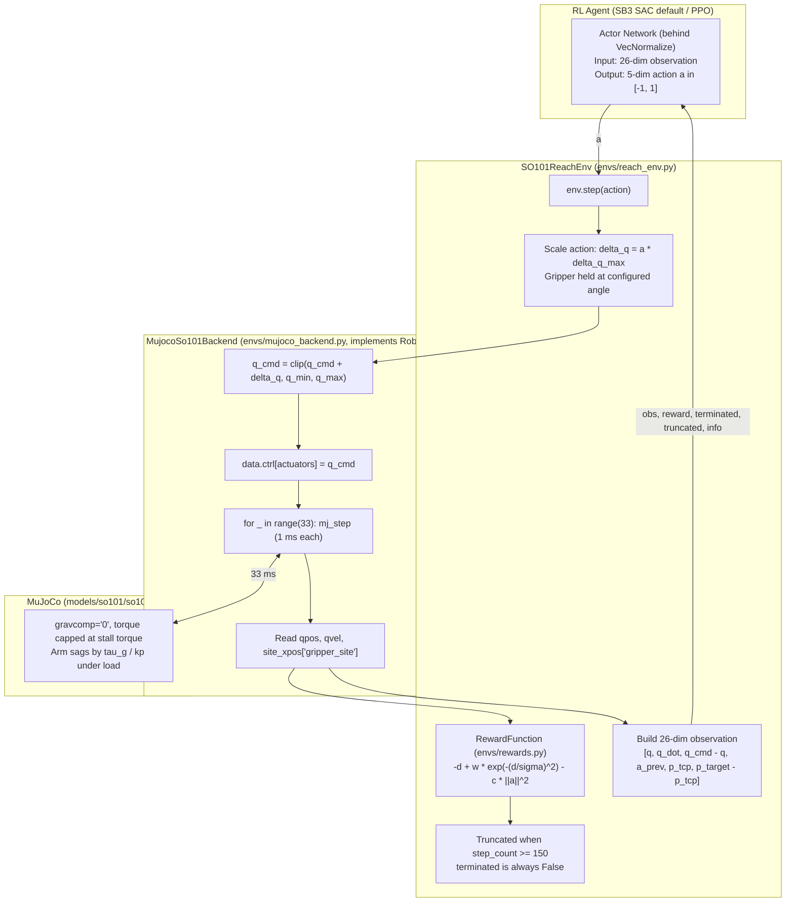
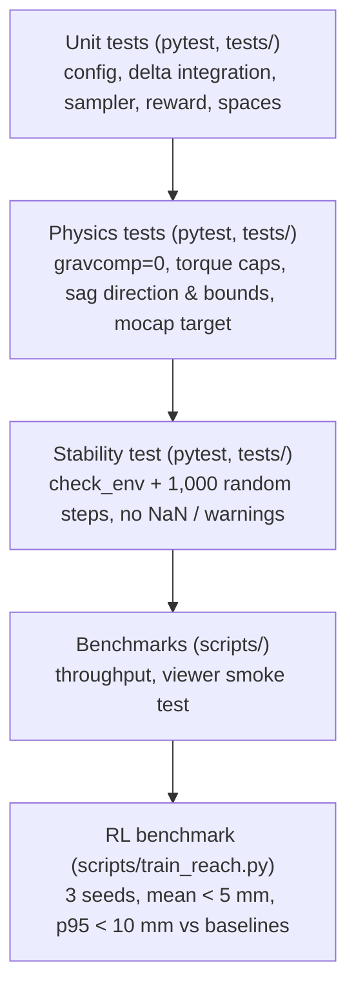

# SO-101 Gymnasium Interface & Sanity Reach Baseline

## 0. Plain English Overview, Background, and Feature Goals

### Background: Where We Are Today
The SO-101 is a low-cost, open-source 6-DoF desktop robot arm (5 arm joints + 1 gripper jaw) powered by Feetech STS3215 serial bus servos. In our workspace, we already have a MuJoCo model (`models/so101/so101.xml`) converted from Hugging Face's official calibration URDF. The arm is mounted on a table (`robot_mount` at $x = -0.20\,\text{m}$, $z = 0.4775\,\text{m}$) facing a cube, with position actuators and joint limits mapped.

However, the current codebase interacts with MuJoCo exclusively through standalone diagnostic scripts (`scripts/test_table_cube.py`, `scripts/so101_runtime.py`, `scripts/test_ik.py`). These verify basic kinematics and rendering, but they do not expose a standardized interface that reinforcement learning (RL) algorithms can talk to. The model also has artificial gravity compensation enabled (`gravcomp="1"`), which applies a fictitious upward force to every link. No real robot has an equivalent, so it hides how the actuators behave under load.

---

### Why We Need a Gymnasium Wrapper Around MuJoCo
MuJoCo is a raw physics engine: at each millisecond, you provide actuator inputs, and it solves the equations of motion, collision constraints, and contact dynamics. Raw MuJoCo does not know what an "episode", "action", "observation", or "reward" is.

**Gymnasium** (the maintained successor to OpenAI Gym by the Farama Foundation) is the standard RL environment protocol in Python. Wrapping MuJoCo in a `gymnasium.Env` subclass gives us three capabilities:

1. **Standardized Control Loop (~30 Hz)**:
   MuJoCo integrates at $1\,\text{ms}$ for numerical stability (`implicitfast`). The physical SO-101 is commanded over the Feetech bus at roughly 30 Hz. The wrapper runs 33 MuJoCo substeps per policy step, giving a $33\,\text{ms}$ control period ($\approx 30.3\,\text{Hz}$), close to the real command cadence.

2. **Safe Action Mapping (Relative Delta Positioning $\Delta q$)**:
   Instead of torques or absolute joint targets (which cause bang-bang motion during exploration), the wrapper maps normalized policy actions $a \in [-1, 1]$ to small relative changes of the commanded joint angles, $\Delta q = a \cdot \Delta q_{\max}$ with $\Delta q_{\max} = 0.07\,\text{rad}$ ($4^\circ$) per step. This caps commanded joint speed at about $120^\circ/\text{s}$ and makes $a = 0$ mean "hold the current command".

3. **Plug-and-Play Compatibility with Modern RL**:
   With standard `reset()`/`step()` methods and typed `observation_space`/`action_space` (`gymnasium.spaces.Box`), the environment plugs directly into Stable-Baselines3 (SAC, PPO) with no glue code.

---

### Why Start with a Sanity Reaching Baseline?
Our end goal is autonomous pick-and-place. Pick-and-place combines contact dynamics, grasp alignment, friction, and a severe exploration bottleneck. If we built it first and training failed, we could not tell whether the cause was contact physics, reward shaping, observation bugs, actuator behavior, or exploration.

To de-risk the pipeline, we follow a **"crawl-walk-run"** approach:
- We build **`SO101ReachEnv`**: the gripper is held fixed and the 5 arm joints move the end-effector (`gripper_site`) to a randomly sampled, **verified-reachable** 3D target in free space.
- Gravity compensation is removed (`gravcomp="0"`) and actuator torque is capped at a realistic stall torque, so the actuators carry the real gravitational load.
- If an RL agent reliably holds the end-effector **within 5 mm** of the target (well below the ~12 mm static sag of the uncompensated arm), we have shown that:
  1. The MuJoCo-to-Gymnasium bridge is correct and numerically stable.
  2. Observations, actions, and rewards are wired correctly to the learner.
  3. The policy uses closed-loop feedback to reject a steady-state disturbance (sag), rather than just replaying an inverse-kinematics pose.

**What this milestone does *not* prove**: it does not prove Sim2Real readiness. The magnitude of simulated sag is set by actuator gains we have not yet calibrated (see Step 1.0). This milestone validates the *software and learning pipeline*; the next milestone makes the *physics* trustworthy.

---

### How This Ties to Actuator Calibration, Demo Bootstrapping, and Sim2Real
This feature is the first brick in our Sim2Real foundation:

1. **Digital Twin Actuator Calibration (Next Step)**:
   Once the Gymnasium environment runs reliably under `gravcomp="0"`, we replay real teleoperation trajectories from Hugging Face (`lerobot/svla_so101_pickplace`) through the environment to tune actuator stiffness ($k_p$), damping, friction, and backlash until simulation matches hardware telemetry ($\text{MAE} \le 5^\circ$). Only after this step does the simulated sag mean anything physically.

2. **Bootstrapping Manipulation (Step After Calibration)**:
   With calibrated actuators, we use the inverse kinematics solver (`rbe_501_so101.kinematics`) to script reach-grasp-lift demonstrations in simulation and pre-fill the RL replay buffer, removing the exploration bottleneck.

3. **Sim2Real Deployment (Final Destination)**:
   Transfer relies on (a) calibrated actuator dynamics, (b) the same 30 Hz delta-position command interface as the real Feetech bus, (c) a state-based observation that can be reproduced on hardware (joint encoders plus an AprilTag camera tracker), and (d) policies trained with randomized actuator dynamics so they rely on feedback rather than memorized offsets. The `RobotBackend` protocol introduced here lets the same policy code drive either the MuJoCo backend or a future hardware backend.

---

## 1. Detailed Implementation Steps & Code Flow

### Step 1.0: How to Think About Gravity, Sag, and the Robot

A position-controlled servo behaves like a stiff spring wrapped around a joint. When you command an angle, the servo only pushes back once the joint has been pulled *away* from that angle, and it pushes harder the further away it is. Gravity is always pulling the links down, so the joint settles at the point where the servo's restoring torque exactly equals the gravitational torque. The gap between where we told the joint to go and where it actually rests is **sag**. For a simple proportional servo this gap is roughly the gravity torque divided by the stiffness ($\Delta q \approx \tau_g / k_p$), so sag gets worse when the arm is stretched out (longer lever arm, larger $\tau_g$) and better when the servo is stiffer (larger $k_p$).

That means the ~11.6 mm sag we measured in `scripts/diagnose_tracking.py` is **not a property of the real robot**. It is the result of the stiffness values currently written in `so101.xml` (`kp="20"` on the shoulder and elbow, `6` on the wrist flex, `4` on the wrist roll and gripper), which are placeholder guesses. Double those gains and the simulated sag roughly halves; at a fully extended pose it grows well beyond 11.6 mm. The real STS3215 runs a much stiffer internal position loop, so most of the real arm's droop comes from different sources: gear backlash (a small dead zone where the joint can move freely), flex in the plastic links, and running into the servo's torque limit at extended poses. Those effects are nonlinear and depend on the direction of motion, so they do not look like a clean spring.

The practical consequence is that a policy which simply learns "aim about 1 cm high" has learned the stiffness of *our simulator*, not of the robot, and that habit will not transfer. We still want `gravcomp="0"`, because gravity compensation is a fictitious force that no physical robot has, and removing it keeps the actuators loaded honestly and exposes torque limits. But we treat sag as a **disturbance the policy must correct through feedback**, not as a constant to memorize. Concretely: (1) the observation includes the commanded joint angles and the distance from the gripper to the target, so the policy can see the error it needs to remove; (2) the success gate (5 mm) is set well below the uncompensated sag (~12 mm), so passing actually requires correction; (3) actuator torque is capped at the real servo's stall torque so the policy cannot rely on strength the hardware lacks; and (4) actuator stiffness and damping can be randomized during training, so the only strategy that works across all variations is closing the loop. Once actuator calibration (the next milestone) gives us realistic gains, we re-measure sag and revisit any claims about Sim2Real.

---

### End-to-End Code Flow Architecture

The diagram below shows how data and commands flow through the system during a single RL step:



---

### Step 1.1: Package Structure, Configuration & Dependencies

**Goal**: Turn the placeholder repository into an installable, typed Python package named `rbe_501_so101`, with all tunable values in one configuration module.

1. **Rename Package Directory**:
   - Rename `src/project/` to `src/rbe_501_so101/`.
   - Create subpackages:
     - `src/rbe_501_so101/envs/`: Gymnasium environments, backends, rewards, target samplers.
     - `src/rbe_501_so101/kinematics/`: inverse kinematics (reserved for a later milestone).
     - `src/rbe_501_so101/perception/`: AprilTag detection and sensor models (reserved).
     - `src/rbe_501_so101/hardware/`: physical robot backend (reserved).
   - Create a top-level `tests/` directory for pytest.

2. **Configuration (`src/rbe_501_so101/config.py`)**:
   All tunable constants live in frozen dataclasses; no magic numbers appear in environment code.
   ```python
   @dataclass(frozen=True)
   class SimConfig:
       model_path: Path = MODELS_DIR / "so101" / "so101.xml"
       n_substeps: int = 33
       initial_deg: tuple[float, ...] = (0.0, -20.0, 40.0, 15.0, 0.0, 40.0)
       stall_torque_nm: float = 2.9

   @dataclass(frozen=True)
   class ReachTaskConfig:
       delta_q_max_rad: float = 0.07
       max_episode_steps: int = 150
       gripper_hold_deg: float = 40.0

   @dataclass(frozen=True)
   class TargetSamplerConfig:
       z_min_m: float = 0.50
       radial_min_m: float = 0.12
       radial_max_m: float = 0.32
       joint_limit_margin_rad: float = 0.15

   @dataclass(frozen=True)
   class RewardConfig:
       bonus_weight: float = 1.0
       bonus_sigma_m: float = 0.005
       action_penalty: float = 0.01

   @dataclass(frozen=True)
   class DynamicsRandomizationConfig:
       enabled: bool = False
       kp_scale_range: tuple[float, float] = (0.7, 1.3)
       damping_scale_range: tuple[float, float] = (0.7, 1.3)
       payload_mass_range_kg: tuple[float, float] = (0.0, 0.05)
   ```
   - `stall_torque_nm` must be confirmed against the exact STS3215 variant on our arm (the 12 V version is rated about 30 kg·cm, roughly 2.9 N·m).
   - `radial_min_m`/`radial_max_m` are measured from the shoulder-pan axis. The defaults are placeholders that must be tuned against the reachability map produced by the target sampler tests (Step 1.6).

3. **Update `pyproject.toml`**:
   - Rename the package to `rbe_501_so101`.
   - Add `gymnasium>=1.0.0`, `stable-baselines3>=2.3.0`, and `torch>=2.0.0` alongside the existing `mujoco` and `numpy` dependencies; add `pytest` as a dev dependency.
   - Install in editable mode (`uv pip install -e .`) so scripts and tests can `from rbe_501_so101.envs import SO101ReachEnv`.

---

### Step 1.2: MuJoCo Physics Model Updates (`models/so101/so101.xml`)

**Goal**: Remove fictitious forces, cap actuator strength at realistic values, and add a movable target marker.

1. **Disable Gravity Compensation (`gravcomp="0"`)**:
   - On the 6 robot bodies (`shoulder_link`, `upper_arm_link`, `lower_arm_link`, `wrist_link`, `gripper_link`, `moving_jaw_so101_v1_link`), change `gravcomp="1"` to `gravcomp="0"`.
   - *Result*: The actuators carry the full gravitational load and the arm sags by roughly $\tau_g / k_p$ at each joint (see Step 1.0).

2. **Cap Actuator Torque at Real Stall Torque**:
   - Every joint currently has `actuatorfrcrange="-10 10"`, about 3.4× what an STS3215 can produce. Replace it with the configured stall torque (`SimConfig.stall_torque_nm`, default ±2.9 N·m). The backend also applies this at load time, so the config stays the single source of truth.
   - *Result*: The policy cannot learn to depend on torque the hardware lacks, and extended poses saturate as they would on the real arm.

3. **Add Gripper Contact Friction Parameters**:
   - On the stationary jaw geom (`wrist_roll_follower_so101_v1`) and moving jaw geom (`moving_jaw_so101_v1`), add:
     ```xml
     friction="1.5 0.01 0.001" solimp="0.9 0.95 0.001" solref="0.005 1"
     ```
   - *Result*: Prevents slipping when grasping in later milestones. No effect on reaching.

4. **Add a Mocap Reach Target**:
   - MuJoCo recomputes `data.site_xpos` from the model at every step, so writing to it does not move anything. Instead, add a mocap body under `<worldbody>`:
     ```xml
     <body name="reach_target" mocap="true" pos="0 0 0.6">
       <site name="reach_target_site" type="sphere" size="0.012"
             rgba="1.0 0.1 0.1 0.7"/>
     </body>
     ```
   - On reset, the environment writes the sampled target to `data.mocap_pos[target_mocap_id]`. Sites never collide, so the marker does not affect physics.

---

### Step 1.3: Abstractions — `RobotBackend`, `TargetSampler`, `RewardFunction`

**Goal**: Separate *what the task is* from *how the robot is driven*, so the same environment code can later run on hardware, and so the target and reward logic can be unit-tested in isolation.

1. **`RobotBackend` protocol (`envs/protocols.py`)** — the repository-style boundary between the task and the robot:
   ```python
   class RobotBackend(Protocol):
       """Interface for any SO-101 (simulated or physical) driven by joint commands."""

       def reset(self, rng: np.random.Generator) -> RobotState: ...
       def apply_delta(self, delta_arm_rad: np.ndarray) -> None: ...
       def step(self) -> RobotState: ...
       def joint_limits(self) -> JointLimits: ...
       def close(self) -> None: ...
   ```
   `RobotState` is a frozen dataclass holding `qpos`, `qvel`, `q_cmd`, and `tcp_pos`.

2. **`TargetSampler` protocol** — `sample(rng) -> np.ndarray` returns a world-frame XYZ target.

3. **`RewardFunction` protocol** — `__call__(state, target, action) -> RewardTerms`, where `RewardTerms` is a dataclass with `distance`, `bonus`, `action_penalty`, and `total` fields (also reported in `info`).

---

### Step 1.4: MuJoCo Backend (`src/rbe_501_so101/envs/mujoco_backend.py`)

**Goal**: Encapsulate MuJoCo bindings, substepping, delta integration, torque caps, randomization, and rendering in `MujocoSo101Backend`, which implements `RobotBackend`.

1. **Initialization**:
   - Load the model from `SimConfig.model_path` and allocate `MjData`.
   - Pre-cache joint, qpos/dof addresses, actuator, site (`gripper_site`), and mocap IDs to avoid string lookups in the stepping loop.
   - Apply `SimConfig.stall_torque_nm` to `model.jnt_actfrcrange` and store nominal `kp`/damping values for randomization.
   - Initialize `q_cmd` from `SimConfig.initial_deg`.

2. **Delta Integration (`apply_delta`)**:
   \[
   q_{\text{cmd}} \leftarrow \text{clip}(q_{\text{cmd}} + \Delta q,\; q_{\min},\; q_{\max})
   \]
   Integration is applied to the *commanded* angle, not the measured one, so a zero action holds the command steady.

3. **Stepping (`step`)**:
   - Write `data.ctrl[actuators] = q_cmd` and run `n_substeps` calls to `mujoco.mj_step`.
   - Return a `RobotState` snapshot.

4. **Dynamics Randomization (`reset`)**:
   - If `DynamicsRandomizationConfig.enabled`, scale each actuator's `kp` (`actuator_gainprm[:, 0]` and the matching `biasprm`) and joint damping by factors drawn from the configured ranges, and add a random payload mass to `gripper_link`. Disabled by default for the baseline and enabled for the robustness evaluation (Step 1.8).

5. **Rendering & Cleanup**:
   - `render_mode="human"` uses `mujoco.viewer.launch_passive()`; `"rgb_array"` uses `mujoco.Renderer`.
   - `set_target_marker(xyz)` writes to `data.mocap_pos`.
   - `close()` shuts down viewers and renderers inside `try/finally`.

---

### Step 1.5: Target Sampler & Reward (`envs/targets.py`, `envs/rewards.py`)

1. **`ReachableTargetSampler`** — samples targets from poses the arm can actually reach, instead of from a fixed Cartesian box:
   - Draw random arm joint configurations within the joint limits shrunk by `joint_limit_margin_rad`.
   - Run forward kinematics (`mj_kinematics`) on a scratch `MjData` to get the gripper tip position.
   - Accept only if $z \ge z_{\min}$ (0.50 m, i.e. 2.5 cm above the 0.475 m tabletop) and the horizontal distance from the shoulder-pan axis lies in $[r_{\min}, r_{\max}]$. Otherwise resample.
   - *Why*: With the base at $x = -0.20\,\text{m}$, the previously proposed box ($x \in [0.10, 0.25]$, $y \in [-0.15, 0.15]$) puts targets 0.30–0.47 m from the base. That is at or beyond the arm's estimated ~0.41 m full extension, where targets are unreachable or gravity torque is at its maximum. Sampling from FK guarantees every target is reachable by construction.

2. **`ReachReward`** — smooth, dense, and sharp enough to reward correcting sag:
   \[
   R_t = -d_t \;+\; w \cdot \exp\!\left(-\left(\frac{d_t}{\sigma}\right)^2\right) \;-\; c\,\|a_t\|_2^2,
   \qquad d_t = \|p_{\text{tcp}} - p_{\text{target}}\|_2
   \]
   with $w = 1.0$, $\sigma = 5\,\text{mm}$, and $c = 0.01$ from `RewardConfig`.
   - *Why*: At the uncompensated sag of ~12 mm the bonus is only $e^{-5.8} \approx 0.003$; at 5 mm it is $0.37$; at 2 mm it is $0.85$. Closing the last centimeter is now worth almost the full bonus, whereas the earlier step-shaped bonus paid out in full to a sagging arm already inside 1.5 cm.

---

### Step 1.6: The Sanity Reach Environment (`src/rbe_501_so101/envs/reach_env.py`)

**Goal**: A focused task environment `SO101ReachEnv(gymnasium.Env)` composed from a `RobotBackend`, a `TargetSampler`, and a `RewardFunction` (all injected, with MuJoCo defaults).

1. **Action Space (5-DoF continuous)**:
   - `spaces.Box(low=-1.0, high=1.0, shape=(5,), dtype=np.float32)` for `shoulder_pan`, `shoulder_lift`, `elbow_flex`, `wrist_flex`, `wrist_roll`.
   - The gripper is held at `ReachTaskConfig.gripper_hold_deg` (40°).

2. **Observation Space (26-dim continuous)**:
   - `spaces.Box(low=-np.inf, high=np.inf, shape=(26,), dtype=np.float32)`:
     \[
     s = [\,q\,(5),\; \dot{q}\,(5),\; q_{\text{cmd}} - q\,(5),\; a_{t-1}\,(5),\; p_{\text{tcp}}\,(3),\; p_{\text{target}} - p_{\text{tcp}}\,(3)\,]
     \]
   - *Why the commanded angles matter*: Because actions are added to the previous commanded angle, the command is part of the system's state. Under sag the command and the measured angle differ by a pose-dependent amount. Without $q_{\text{cmd}} - q$ the policy cannot tell how much correction it has already applied, and therefore cannot learn to hold steady at the right offset.
   - *Why the relative target*: $p_{\text{target}} - p_{\text{tcp}}$ is the error the policy must drive to zero, given directly instead of making the network subtract two absolute positions.
   - The cube is excluded because it has no causal effect on the reaching reward.

3. **Reset**:
   - Reset the backend (with optional dynamics randomization), sample a target from the `TargetSampler`, move the mocap marker, and zero $a_{t-1}$.

4. **Step**:
   - Scale the action by `delta_q_max_rad`, apply it to the backend, step physics, compute `RewardTerms`, and build the observation.
   - `truncated = step_count >= max_episode_steps` (150 steps, about 5 s).
   - `terminated = False` always. The episode never ends early, so the agent must learn to *hold* the target against gravity for the rest of the episode.
   - `info` contains `distance_m` and each reward term.

---

### Step 1.7: Gymnasium Environment Registration (`src/rbe_501_so101/envs/__init__.py`)

```python
from gymnasium.envs.registration import register

register(
    id="SO101Reach-v0",
    entry_point="rbe_501_so101.envs.reach_env:SO101ReachEnv",
    max_episode_steps=ReachTaskConfig().max_episode_steps,
)
```
Any script or test can then create the environment with:
```python
import gymnasium as gym
import rbe_501_so101.envs

env = gym.make("SO101Reach-v0")
```

---

### Step 1.8: Training & Evaluation Runner (`scripts/train_reach.py`)

**Goal**: A CLI to train, evaluate, and benchmark the reaching policy reproducibly.

1. **CLI Arguments**:
   - `--algo`: `sac` (default) or `ppo`.
   - `--timesteps`: total training steps (default `300000`).
   - `--seeds`: list of seeds to train/evaluate (default `0 1 2`).
   - `--randomize-dynamics`: enable `DynamicsRandomizationConfig` during training.
   - `--eval`: evaluate saved checkpoints instead of training.
   - `--model-dir`: checkpoint directory (default `checkpoints/reach/`).
   - `--num-episodes`: evaluation episodes per seed (default `20`).
   - `--render`: open the viewer during evaluation.

2. **Training Workflow**:
   - Build a vectorized env with `Monitor`, wrapped in `VecNormalize` (observations normalized, rewards left unnormalized for interpretability). Save the normalization statistics with each checkpoint.
   - Default algorithm:
     ```python
     model = SAC("MlpPolicy", env, learning_rate=3e-4, buffer_size=300_000,
                 batch_size=256, gamma=0.98, seed=seed, verbose=1)
     model.learn(total_timesteps=args.timesteps)
     ```
   - *Why SAC*: Off-policy learning reuses every transition many times, which is much more sample-efficient than PPO on continuous reaching. 50k PPO steps is only about 24 policy updates (about 330 episodes), far too few for millimeter precision. PPO stays available for comparison.
   - *Future option*: switching to a dict observation (`observation`, `achieved_goal`, `desired_goal`) enables SB3's `HerReplayBuffer`, which helps greatly on goal-reaching tasks with sparse or sharp rewards.

3. **Evaluation**:
   - For each seed, run 20 episodes and record $e_t = \|p_{\text{tcp}}(t) - p_{\text{target}}\|_2$ over the final 30 steps (the holding window).
   - Run the same targets through two baselines: a **random policy** and an **IK-hold baseline** (solve IK for the target, command that pose, never correct). The IK-hold error is the measured uncompensated sag.
   - Repeat the evaluation with dynamics randomization enabled to report robustness (reported, not gated, in this milestone).
   - Print a JSON report with the mean, 95th percentile, and per-seed error for the trained policy and both baselines.

---

## 2. Success Criteria & Testing Plan

### 2.1 The Two Fundamental Success Criteria

1. **Standardized Gymnasium Conformance & Numerical Stability**:
   - The environment passes `gymnasium.utils.env_checker.check_env` with zero errors or warnings.
   - Random-action rollouts produce zero NaN/Inf values and zero MuJoCo solver warnings (`data.warning[:].number` all zero).
   - Headless throughput is benchmarked and reported (target $\ge 1{,}500$ policy steps/s on CPU); it is a performance benchmark, not a correctness test.

2. **Closed-Loop Reaching Below the Sag Floor**:
   - Without gravity compensation, the IK-hold baseline settles about 12 mm below its target at the home pose (more at extended poses). Any policy that merely reproduces IK poses scores at this level.
   - A SAC policy trained for 300k steps must achieve, across **3 seeds** and 20 episodes per seed, over the final 30 steps of each episode:
     - **Mean holding error $< 5\,\text{mm}$**, and
     - **95th-percentile holding error $< 10\,\text{mm}$**,
     - with **every seed** individually below the mean threshold, and the trained policy clearly better than the IK-hold baseline on the same targets.
   - The arm must hold steadily: no oscillation visible in the viewer, and mean joint speed in the holding window below a configured threshold.

---

### 2.2 Testing Strategy

Following test-driven development, deterministic behavior is tested with **pytest in `tests/`**, written *before* the corresponding implementation and verified to fail first. Stochastic or slow checks (throughput, RL convergence, visual inspection) are **benchmarks** in `scripts/`, not unit tests.



---

#### Unit Tests (`tests/test_backend.py`, `tests/test_targets.py`, `tests/test_rewards.py`, `tests/test_reach_env.py`)
- **Delta integration**: a zero action leaves `q_cmd` unchanged; a full action changes it by exactly `delta_q_max_rad`; commands are clipped to joint limits.
- **Spaces**: action space is `Box((5,), [-1, 1], float32)`; observation space is `Box((26,), float32)`; `reset()` returns `(obs, info)` and `step()` returns a 5-tuple with `obs.dtype == np.float32`.
- **Observation layout**: the $q_{\text{cmd}} - q$ slice equals the backend's command minus measured angles; the relative-target slice equals `target - tcp_pos`.
- **Target sampler**:
  - 1,000 sampled targets all satisfy $z \ge 0.50\,\text{m}$ and the radial band.
  - Every sampled target is reachable: re-solving IK for it gives a pure kinematic error $< 1\,\text{mm}$.
  - The same seed produces the same targets.
  - A helper also exports a reachability map, used to tune `radial_min_m`/`radial_max_m`.
- **Reward**: the bonus is exactly `w` at $d = 0$, $w e^{-1}$ at $d = \sigma$, and negligible ($< 0.01\,w$) at 12 mm; the reward decreases monotonically with distance; the action penalty matches $c\|a\|^2$.

#### Physics Tests (`tests/test_physics.py`)
- `model.body_gravcomp == 0` for all 6 robot bodies.
- `jnt_actfrcrange` for each arm joint equals $\pm$`stall_torque_nm`.
- **Sag direction and bounds** (no fixed millimeter band, since sag depends on uncalibrated gains):
  - Hold zero actions for 150 steps from the home pose.
  - The gripper tip moves *downward* ($\Delta z < 0$).
  - The joints settle (joint speed below threshold by the end).
  - The drop stays below a generous safety bound (e.g. 30 mm) and causes no arm–table contact.
- Writing a target to the mocap body moves `reach_target_site` to that position after `mj_forward`.

#### Stability Test (`tests/test_stability.py`)
- `check_env(env.unwrapped)` passes with no warnings.
- 1,000 random-action steps with auto-reset: no NaN/Inf in observations or rewards, and all MuJoCo warning counters zero.

#### Benchmarks (`scripts/benchmark_env.py`)
- **Throughput**: report policy steps/s over 10,000 headless random steps.
- **Viewer smoke test** (`--render`): run 3 episodes and visually confirm:
  - the arm is mounted on the table and sags smoothly without vibration;
  - the red target sphere moves to each new target and is always above the tabletop;
  - closing the window exits cleanly.

#### RL Benchmark (`scripts/train_reach.py`)
1. Train:
   ```bash
   python scripts/train_reach.py --algo sac --timesteps 300000 --seeds 0 1 2
   ```
2. Evaluate against baselines:
   ```bash
   python scripts/train_reach.py --eval --model-dir checkpoints/reach/ --num-episodes 20
   ```
3. Pass criteria:
   - Episode return rises and plateaus for every seed.
   - Holding window statistics across $3 \times 20 \times 30$ samples:
     \[
     \bar{e}_{\text{holding}} = \frac{1}{N}\sum_{\text{seed}}\sum_{ep}\sum_{t=121}^{150} \|p_{\text{tcp}}(t) - p_{\text{target}}\|_2 < 0.005\,\text{m}, \qquad e_{95} < 0.010\,\text{m}
     \]
   - Expected ordering: random policy (tens of centimeters) $\gg$ IK-hold baseline (~1–2 cm, pose-dependent sag) $>$ trained policy ($< 5\,\text{mm}$).
4. Visual inspection with `--render`: the arm moves smoothly to the target sphere, enters it, and holds without jitter or table contact.

---

### 2.3 Failure Modes & Diagnostic Troubleshooting Matrix

| Observed Symptom | Root Cause | Immediate Diagnostic & Fix |
| :--- | :--- | :--- |
| **Arm vibrates or oscillates in simulation** | Substeps or action scale too aggressive, or damping too low. | Confirm `n_substeps = 33` with `timestep = 0.001` and `delta_q_max_rad <= 0.07`. Check `dampratio` on the actuators. |
| **`check_env()` fails on observation shape/dtype** | Dimension or dtype mismatch. | Ensure observations are built with `np.asarray(..., dtype=np.float32)` and have shape `(26,)`. |
| **Return stays flat** | Unreachable targets, unnormalized observations, or too few steps. | Run the sampler reachability test; confirm `VecNormalize` wraps the env; check that `distance_m` in `info` trends down. |
| **Policy plateaus near the IK-hold baseline (~1 cm low)** | Policy not using feedback to remove sag. | Confirm the $q_{\text{cmd}} - q$ and relative-target slices are present and nonzero under load; confirm the bonus `sigma` is 5 mm, not larger. |
| **Good on nominal dynamics, poor with randomization** | Policy memorized a sim-specific offset. | Train with `--randomize-dynamics`; this is the behavior Step 1.0 warns about. |
| **Arm stalls at extended poses** | Torque cap reached (expected near full extension). | Check the reachability map; tighten `radial_max_m` if targets sit at the torque limit. |
| **Target sphere does not move** | Writing to `site_xpos` instead of `mocap_pos`. | Use the mocap body and call `mj_forward` after setting the position. |
| **Viewer crashes on exit** | Unclosed renderer context. | Ensure the backend's `close()` releases viewer and renderer inside `try/finally`. |

---

## 3. Alternatives Considered & Decision Rationale

### 3.1 Action Space: Relative Delta Positioning vs. Absolute Joint Angles vs. Torque Control

- **Alternative 1: Absolute Joint Position Commands**:
  - *How it works*: $q = q_{\min} + \frac{a + 1}{2}(q_{\max} - q_{\min})$.
  - *Why rejected*: Random exploration jumps between joint extremes at 30 Hz. In simulation this causes contact clipping; on STS3215 servos it causes current spikes, overcurrent shutdowns, and gear wear.
- **Alternative 2: Direct Torque Control**:
  - *Why rejected*: STS3215 servos run closed firmware position loops over a half-duplex UART bus and do not expose high-rate torque control. A torque policy could not be executed on hardware.
- **Selected Decision: Relative Delta Positioning**:
  - $q_{\text{cmd},t+1} = \text{clip}(q_{\text{cmd},t} + a_t \cdot \Delta q_{\max}, q_{\min}, q_{\max})$ with $\Delta q_{\max} = 0.07\,\text{rad}$ per 33 ms step (about $120^\circ/\text{s}$).
  - *Advantages*: a built-in speed limit; $a = 0$ means "hold the command", so an untrained network keeps the arm steady; smooth commands that suit serial servos.
  - *Consequence*: the command becomes part of the state, so it must be observed (see 3.7).

---

### 3.2 Observation & Task Scope: Task-Specific Spaces vs. a Single Unified Space

- **Alternative Considered: One `SO101Env` with a unified observation (joint state, cube pose, goal) and 6-DoF action for every task**.
  - *Why rejected*: Static cube coordinates have no causal link to the reaching reward and slow learning; an unpenalized gripper action produces random gripper flutter; dummy features complicate debugging.
- **Selected Decision: Composition of shared parts with task-specific environments**:
  - Following Gymnasium Robotics (`FetchReach` vs `FetchPickAndPlace`), `SO101ReachEnv` and the future `SO101PickPlaceEnv` share a `RobotBackend`, but each defines its own observation, reward, and target sampler.
  - Pick-and-place will be seeded with scripted IK demonstrations, so we do not need to transfer network weights from reaching.

---

### 3.3 Target Sampling: Reachable-Set Sampling vs. Cartesian Box

- **Alternative 1: Box with $z \in [0.45, 0.60]\,\text{m}$**:
  - *Why rejected*: The tabletop surface is at $z = 0.475\,\text{m}$, so the lower part of this box is inside the table.
- **Alternative 2: Box with $x \in [0.10, 0.25]$, $y \in [-0.15, 0.15]$, $z \in [0.50, 0.65]\,\text{m}$**:
  - *Why rejected*: It fixes the table problem but not reachability. The base sits at $x = -0.20\,\text{m}$, so these targets are 0.30–0.47 m from the base, against an estimated ~0.41 m full extension. A large fraction of targets would be unreachable or at full stretch, imposing penalties the policy cannot avoid and corrupting the evaluation.
- **Selected Decision: Sample from forward kinematics with clearance and radial filters**:
  - Every target is produced by an actual joint configuration (within margin of the limits), so it is reachable by construction, is at least 2.5 cm above the table, and lies in a configurable radial band that keeps away from singular full-extension poses.

---

### 3.4 Reinforcement Learning Library & Algorithm

- **Alternative 1: Hugging Face LeRobot** — an imitation learning framework (BC, ACT, Diffusion) trained from offline datasets; it does not provide online RL like SAC or PPO. Rejected for this step.
- **Alternative 2: Hugging Face TRL** — designed for language-model alignment over discrete tokens; no continuous-control support. Rejected.
- **Alternative 3: Custom PPO** — high risk of subtle bugs that would confound environment debugging. Rejected.
- **Selected Decision: Stable-Baselines3, with SAC as the default**:
  - SB3 is the standard, tested PyTorch library for continuous control and works directly with `gymnasium.Env`, `Monitor`, and `VecNormalize`.
  - SAC is chosen over PPO because off-policy replay makes it much more sample-efficient on continuous reaching. PPO remains available as a comparison. HER is a documented follow-up if a goal-conditioned dict observation is adopted.

---

### 3.5 Physics Grounding: Uncompensated Gravity vs. Idealized `gravcomp="1"`

- **Alternative Considered: Keep `gravcomp="1"`**:
  - *Why considered*: It keeps the arm from drooping and makes IK tests show sub-millimeter tracking (0.85 mm in `scripts/diagnose_tracking.py`).
  - *Why rejected*: It is a fictitious force with no hardware equivalent, it hides torque saturation, and it removes the steady-state error that any real position-controlled arm has.
- **Selected Decision: `gravcomp="0"` with realistic torque caps, treated as a disturbance**:
  - The actuators carry the true gravitational load and the policy must correct the resulting error through feedback.
  - *Important caveat*: The amount of simulated sag (~11.6 mm at the home pose) comes from placeholder actuator gains, not from the hardware (Step 1.0). This milestone does not claim the learned correction transfers to the real arm. Transfer depends on actuator calibration (next milestone) and dynamics randomization.

---

### 3.6 Task Phasing: Sanity Reaching Baseline First vs. Direct-to-Pick-and-Place

- **Alternative Considered: Implement pick-and-place immediately**.
  - *Why rejected*: Contact events, grasp alignment, friction, perception, and exploration all fail in ways that are hard to tell apart.
- **Selected Decision: Reaching baseline first**:
  - It validates stepping, observation flow, reward wiring, normalization, and feedback correction of sag on an unambiguous task before any object contact is introduced.

---

### 3.7 Observation Content: Including Commanded Angles vs. Measured State Only

- **Alternative Considered: Observe only $[q, \dot{q}, p_{\text{tcp}}, p_{\text{target}}]$ (16 dims)**.
  - *Why rejected*: With delta actions the commanded angle $q_{\text{cmd}}$ is hidden state. Under gravity load $q_{\text{cmd}} \ne q$, and the gap depends on pose. Without it, two identical-looking observations can need different actions to hold position, so the problem becomes partially observable exactly where the success criterion is measured.
- **Selected Decision: 26-dim observation with $q_{\text{cmd}} - q$, the previous action, and the relative target**.
  - This restores the Markov property, gives the policy direct visibility of the sag it is fighting, and expresses the target as the error to be driven to zero. On hardware $q_{\text{cmd}}$ is known exactly (we send it) and $q$ comes from the servo encoders, so the observation can be reproduced on the real robot.

---

## 4. Detailed File Modification Manifest & Implementation Specifications

```
rbe501_group_project/
├── pyproject.toml                                     [MODIFIED]
├── .gitignore                                         [MODIFIED]
├── models/so101/so101.xml                             [MODIFIED]
├── src/
│   └── rbe_501_so101/                                 [NEW PACKAGE / RENAMED FROM src/project]
│       ├── __init__.py                                [CREATED]
│       ├── config.py                                  [CREATED]
│       └── envs/
│           ├── __init__.py                            [CREATED]
│           ├── protocols.py                           [CREATED]
│           ├── types.py                               [CREATED]
│           ├── mujoco_backend.py                      [CREATED]
│           ├── targets.py                             [CREATED]
│           ├── rewards.py                             [CREATED]
│           └── reach_env.py                           [CREATED]
├── tests/
│   ├── conftest.py                                    [CREATED]
│   ├── test_backend.py                                [CREATED]
│   ├── test_targets.py                                [CREATED]
│   ├── test_rewards.py                                [CREATED]
│   ├── test_reach_env.py                              [CREATED]
│   ├── test_physics.py                                [CREATED]
│   └── test_stability.py                              [CREATED]
└── scripts/
    ├── benchmark_env.py                               [CREATED]
    └── train_reach.py                                 [CREATED]
```

---

### 4.1 Modified Existing Files

#### 1. `pyproject.toml`
- Rename `name = "project"` to `name = "rbe_501_so101"` and remove the placeholder script entry `project = "project:main"`.
- Runtime dependencies:
  ```toml
  dependencies = [
      "gymnasium>=1.0.0",
      "huggingface-hub>=0.36.2",
      "mujoco>=3.2.3",
      "numpy>=1.24.4",
      "stable-baselines3>=2.3.0",
      "torch>=2.0.0",
  ]
  ```
- Dev dependency group: `pytest>=8.0`.

#### 2. `models/so101/so101.xml`
- Change `gravcomp="1"` to `gravcomp="0"` on the 6 robot bodies.
- Replace `actuatorfrcrange="-10 10"` on every robot joint with the configured stall torque (default `-2.9 2.9`).
- Add friction/solref/solimp to the two jaw geoms (see Step 1.2).
- Add the `reach_target` mocap body containing the non-colliding `reach_target_site` sphere.

#### 3. `.gitignore`
- Append:
  ```gitignore
  # Reinforcement Learning Checkpoints & Logs
  checkpoints/
  *.monitor.csv
  logs/
  ```

---

### 4.2 New Library Files (`src/rbe_501_so101/`)

#### 4. `__init__.py`
- Package docstring and `__version__ = "0.1.0"`.

#### 5. `config.py`
- Frozen dataclasses: `SimConfig`, `ReachTaskConfig`, `TargetSamplerConfig`, `RewardConfig`, `DynamicsRandomizationConfig`, and a `TrainConfig` (algorithm, timesteps, seeds, SAC hyperparameters, evaluation episodes, holding window length, success thresholds of 5 mm mean / 10 mm p95).

#### 6. `envs/types.py`
- Frozen dataclasses: `RobotState` (`qpos`, `qvel`, `q_cmd`, `tcp_pos`), `JointLimits` (`lower`, `upper`), `RewardTerms` (`distance`, `bonus`, `action_penalty`, `total`).

#### 7. `envs/protocols.py`
- `RobotBackend`, `TargetSampler`, and `RewardFunction` protocols (Step 1.3).

#### 8. `envs/mujoco_backend.py`
- `MujocoSo101Backend` implementing `RobotBackend`:
  - Model loading, ID caching, torque caps, delta integration with clipping, substepping, optional dynamics randomization, mocap target marker, rendering, and cleanup (Step 1.4).

#### 9. `envs/targets.py`
- `ReachableTargetSampler` implementing `TargetSampler`: samples via forward kinematics with clearance, radial band, and joint-margin filters; deterministic under a seeded `np.random.Generator`; plus a helper that exports a reachability map (Step 1.5).

#### 10. `envs/rewards.py`
- `ReachReward` implementing `RewardFunction`: $-d + w\,e^{-(d/\sigma)^2} - c\|a\|^2$, returning `RewardTerms` (Step 1.5).

#### 11. `envs/reach_env.py`
- `SO101ReachEnv(gymnasium.Env)` composed from injected backend, sampler, and reward:
  - **Action space**: `Box((5,), [-1, 1], float32)`, scaled by `delta_q_max_rad`.
  - **Observation space**: `Box((26,), float32)` with layout $[q, \dot{q}, q_{\text{cmd}} - q, a_{t-1}, p_{\text{tcp}}, p_{\text{target}} - p_{\text{tcp}}]$.
  - **Reset**: backend reset, target sampling, mocap marker update.
  - **Step**: returns `(obs, reward, False, truncated, info)` with `truncated` at 150 steps and `info` holding `distance_m` and the reward terms.

#### 12. `envs/__init__.py`
- Registers `SO101Reach-v0` with `max_episode_steps` from `ReachTaskConfig`.

---

### 4.3 New Test Files (`tests/`)

#### 13. `conftest.py`
- Shared fixtures: default configs, a seeded RNG, a MuJoCo backend, and a reach env.

#### 14–19. `test_backend.py`, `test_targets.py`, `test_rewards.py`, `test_reach_env.py`, `test_physics.py`, `test_stability.py`
- Implement the unit, physics, and stability tests in Section 2.2. Each test is written before the code it covers and must fail before implementation begins.

---

### 4.4 New Executable Scripts (`scripts/`)

#### 20. `scripts/benchmark_env.py`
- Reports headless throughput (policy steps/s) and, with `--render`, runs the 3-episode viewer smoke test.

#### 21. `scripts/train_reach.py`
- CLI described in Step 1.8:
  - **Training mode**: builds `Monitor` + `VecNormalize` envs, trains SAC (default) or PPO for each seed, and saves the model plus normalization statistics to `checkpoints/reach/seed_<n>/`.
  - **Evaluation mode**: loads each seed's checkpoint and normalization statistics, evaluates 20 episodes on nominal dynamics and with dynamics randomization, runs the random and IK-hold baselines on the same targets, and prints a JSON report with mean, p95, and per-seed holding error. The run passes if the mean is under 5 mm, the p95 is under 10 mm, and every seed meets the mean threshold.
