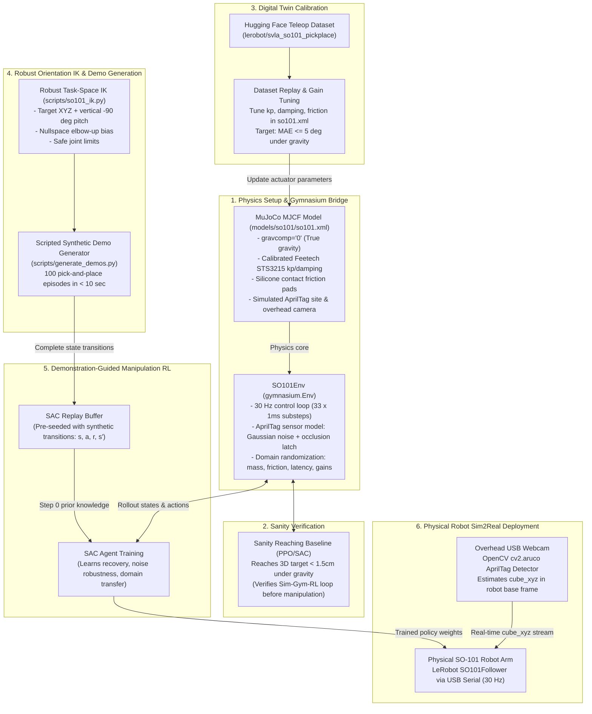
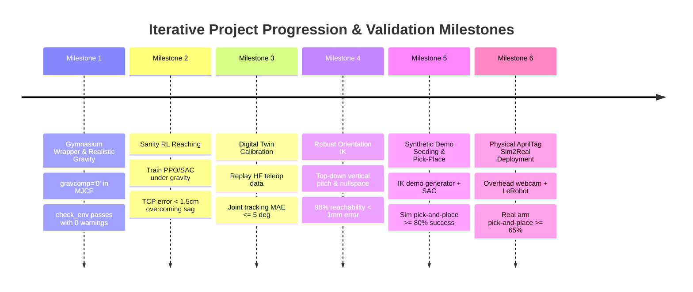

# Sim2Real Action Plan: SO-101 Robot Arm

## 1. Executive Summary: Current State & Desired Goals

### Where We Stand
- **MuJoCo Physical Model**: A fully verified MuJoCo MJCF model already exists at `models/so101/so101.xml`. It was converted directly from Hugging Face's official `so101_new_calib.urdf` and references 16 official 3D STL meshes stored in `models/so101/assets/`.
- **Actuation & Kinematics**: The 6 degrees of freedom (5 arm joints + 1 gripper jaw) use position actuators matching the Feetech STS3215 serial bus servos. Baseline tests in `scripts/test_table_cube.py`, `scripts/test_all_actuators.py`, and `scripts/test_ik.py` confirm sub-millimeter kinematic accuracy and physical contact dynamics with the tabletop and cube.
- **Diagnostics & Gravitational Sag**: Baseline measurements in `scripts/diagnose_tracking.py` prove that under idealized simulation compensation (`gravcomp="1"`), tracking error is 0.85 mm, but under real uncompensated gravity (`gravcomp="0"`), the physical arm deflects by ~11.6 mm under its own weight.
- **Software Stack**: The workspace has Python 3.12 with `lerobot` (v0.6.1), `mujoco` (v3.14.0), `gymnasium` (v1.3.0), and `torch` (v2.11.0) ready in the local environment.

### Desired Goals
1. **Standardized Gymnasium Interface (`SO101Env`)**: Wrap the MuJoCo simulation into a standard `gymnasium.Env` subclass to support out-of-the-box reinforcement learning algorithms (Stable-Baselines3 SAC/PPO).
2. **State-Based Control with Real-World AprilTag Pose Estimation**: Train a fast, robust state-based policy using a compact observation vector (joint states, TCP position, and cube position). In reality, cube position is tracked via an overhead camera with an AprilTag/ArUco marker, bypassing the visual Sim2Real domain gap entirely.
3. **Sanity Reaching Baseline Before Complex Tasks**: Verify that the core simulation-to-RL loop converges under uncompensated gravity on a simple 3D reaching task before adding dataset replay or grasping complexity.
4. **Digital Twin Actuator Calibration via Hugging Face Datasets**: Replay real-world human teleoperated trajectories from `lerobot/svla_so101_pickplace` in simulation under realistic gravity (`gravcomp="0"`) to calibrate simulated actuator stiffness ($k_p$), damping, and gear friction against physical Feetech STS3215 response curves.
5. **Robust Orientation-Constrained Inverse Kinematics (`scripts/so101_ik.py`)**: Upgrade the baseline position-only IK solver to an orientation-constrained task-space solver with nullspace elbow management, guaranteeing reliable top-down vertical grasp approach angles ($\text{pitch} = -90^\circ$) and collision-free elbow postures.
6. **Synthetic Demonstration Seeding via MuJoCo IK**: Overcome the sparse-reward exploration bottleneck on step 0 by pre-filling the RL replay buffer with scripted demonstration trajectories generated by the upgraded IK solver.
7. **Robust Sim2Real Hardware Deployment**: Deploy the trained policy directly to the physical SO-101 arm using LeRobot's `SO101Follower` runtime at a matched 30 Hz control loop.

---

## 2. System Architecture & How the Pieces Fit Together

### Strategic Design Choices: Why State-Based RL with AprilTags vs. End-to-End Vision

A foundational architectural decision in this project is using **state-based reinforcement learning with real-world AprilTag pose estimation** rather than **end-to-end vision (pixels-to-actions via ACT/Diffusion/CNNs)**:

- **Zero Visual Sim2Real Gap**: Vision-based policies operate directly on raw RGB camera pixels. In simulation, subtle rendering discrepancies—such as synthetic lighting, specular highlights, shadow soft-edges, tabletop wood grain textures, and camera lens distortion—create a massive visual domain gap. A vision policy trained on synthetic MuJoCo frames frequently fails in the physical world without extensive, tedious photorealistic domain randomization. In state-based RL, the policy only ever observes physical quantities: joint angles in radians, TCP coordinates in meters, and cube Cartesian coordinates in meters. Once the overhead camera detects the AprilTag, the coordinates fed into the policy are in the exact same physical units in reality as they were in MuJoCo, bypassing the visual domain gap completely.
- **Sample Efficiency & Blazing Fast Training**: The state representation is a compact 25-dimensional vector. An agent equipped with a small 2-layer MLP policy can learn full pick-and-place manipulation in **10 to 20 minutes on a standard laptop CPU**. In contrast, end-to-end vision models (e.g. ResNet/ViT backbones) require hours to days on high-end discrete GPUs.
- **Deterministic 30 Hz Control on Real Hardware**: Evaluating a 2-layer MLP takes less than $0.5\,\text{ms}$, allowing the physical 30 Hz control loop to run reliably on any standard laptop or single-board computer without requiring dedicated GPU acceleration or TensorRT optimization.
- **Isolated, Explainable Debugging**: If the physical robot misses a grasp, state-based control makes it trivial to decouple and identify the failure mode: *Was the camera tag localization off by 4 mm? Did the arm sag under gravity by 10 mm? Or did the policy output an erratic joint command?* In end-to-end vision, diagnosing failures inside a black-box latent visual space is notoriously difficult.

### How We Gradually Simulate AprilTags in MuJoCo (The Two-Tier Strategy)

If we rendered full camera images and ran OpenCV AprilTag corner detection on every single simulation step during RL training, simulation throughput would collapse from **~3,000 steps/sec down to under 30 steps/sec** (a 100x slowdown, turning a 15-minute training run into an overnight job).

To solve this, we simulate AprilTag perception **gradually** across two distinct tiers:

1. **Tier 1: High-Speed Synthetic Sensor Model (Inside `SO101Env` for RL Training)**:
   - During high-speed RL rollouts, `SO101Env` queries MuJoCo's internal `cube_tag_site` coordinates directly, but corrupts them with realistic physical noise:
     - *Calibrated Measurement Noise*: Injects zero-mean Gaussian noise ($\sigma_{xy} = 1.5\,\text{mm}, \sigma_z = 3.5\,\text{mm}$), matching the empirical accuracy of a standard 1080p overhead USB webcam mounted 60 cm above the tabletop.
     - *Gripper Occlusion Simulation & Pose Latching*: When the SO-101 arm descends directly over the cube to grasp it, the wrist motor and fingers physically block the overhead camera's line-of-sight to the tag. In `SO101Env`, whenever the gripper TCP is within 4 cm horizontally and 10 cm vertically above the cube, the tag is marked **occluded**. The environment latches (freezes) the last known tag coordinates. This trains the RL policy to naturally tolerate temporary visual dropouts during the terminal grasp phase, exactly mirroring how a physical pose latch or Kalman filter behaves on real hardware.
2. **Tier 2: Visual Rendering & OpenCV Bridge Test (For Software Verification)**:
   - To verify that our OpenCV computer vision script works prior to connecting physical hardware, we add an overhead `<camera>` geom in `models/so101/so101.xml` and map the actual `tag36h11` marker texture onto the cube's top face.
   - A standalone diagnostic script (`scripts/test_tag_detection.py`) renders an offscreen RGB image from MuJoCo, passes it to the exact same OpenCV `cv2.aruco` detection and coordinate transform pipeline ($^{base}T_{cube} = \,^{base}T_{cam} \cdot \,^{cam}T_{cube}$) used on hardware, and verifies that the detected tag coordinates match MuJoCo's internal world coordinates within $\pm 2\,\text{mm}$.

### The Narrative Flow: How We Proceed and Why (Plain English)

To build a reliable Sim2Real system without getting stuck in debugging loops, we follow a strict "crawl-walk-run" progression where every step validates a specific layer of the stack before adding more complexity:

1. **Step 1: Ground the Simulation in Reality First (Physics & Environment)**: Before writing any learning code, we fix the physics model. We disable artificial gravity compensation (`gravcomp="0"`), add high-friction contact pads to the gripper fingertips, define the AprilTag reference site, and wrap MuJoCo in a standard Gymnasium environment running at 30 Hz. *Why*: If the simulation assumes weightless links or frictionless fingers, any policy trained on it will fail on physical hardware. We need a physically honest sandbox with a clean standard API first.
2. **Step 2: Prove the Core Learning Loop on a Toy Problem (Sanity Reaching Baseline)**: Next, we train a simple reinforcement learning agent (PPO or SAC) on an easy task: moving the end-effector to touch a random 3D point in space under true gravity. *Why*: Grasping an object is complex and has many points of failure. By starting with simple reaching, we verify that MuJoCo, Gymnasium, and the RL algorithm can communicate, compute rewards, backpropagate gradients, and learn to actively overcome the ~11.6 mm of gravitational sag within 10 minutes. If the agent cannot solve this simple reaching task, there is no point in attempting complex manipulation.
3. **Step 3: Align Simulated Motor Response with Real Motors (Digital Twin Calibration)**: Now that the simulation and training loop are confirmed working, we feed recorded human teleoperation commands from Hugging Face (`lerobot/svla_so101_pickplace`) into MuJoCo under true gravity. *Why*: The physical Feetech STS3215 servos have real-world compliance, velocity limits, and inertia. By comparing where the simulated joints move against where the real robot joints moved, we tune actuator stiffness ($k_p$), damping, and friction in our XML until tracking error drops below $5^\circ$. This turns our simulation from an idealized animation into a calibrated digital twin.
4. **Step 4: Upgrade & Validate Robust Option 1 Task-Space IK (`scripts/so101_ik.py`)**: Before generating demonstrations, we replace our baseline position-only solver with a native MuJoCo task-space solver. *Why*: Our initial IK solver only solved for 3D $(x, y, z)$ position, allowing the gripper to arrive at arbitrary pitch and roll tilts. For top-down table grasping, the gripper must point vertically downward ($\text{pitch} = -90^\circ$) with the jaws aligned to the cube, while keeping the elbow biased upward away from the tabletop. Using native MuJoCo spatial Jacobians (`mj_jacSite`) with nullspace projection guarantees collision-free, upright reaching without adding heavy external dependencies.
5. **Step 5: Kickstart Grasping via Synthetic IK Demonstrations (Overcoming the Exploration Bottleneck)**: With a calibrated environment and a robust orientation solver, we tackle pick-and-place. Trying to learn manipulation from scratch via random exploration takes millions of steps because the robot almost never grasps a small 50 mm cube by pure chance. Instead of trying to reconstruct missing 3D coordinates from Hugging Face videos, we use our robust IK solver to script 100 perfect reach-grasp-lift trajectories in 10 seconds. We pre-fill the RL agent's replay buffer with these transitions. *Why*: The agent starts on step 0 already knowing how to grasp, and uses online simulation rollouts to master error recovery, handle misalignments, and generalize across arbitrary cube locations.
6. **Step 6: Harden the Policy Against Real-World Imperfections (Domain Randomization)**: Real hardware is never identical to simulation: cube weight varies, table friction changes, servo commands suffer from transmission latency, and camera tracking has slight jitter. We introduce domain randomization into the environment on every reset. *Why*: A policy trained only on "nominal" physics will be brittle; training across randomized friction, mass, sensor noise, and a 1-step latency buffer forces the neural network to develop robust, forgiving feedback control.
7. **Step 7: Deploy Zero-Shot to Physical Hardware (AprilTag + LeRobot Runtime)**: Finally, we mount an overhead webcam over the real table, run a fast OpenCV script to detect the cube's AprilTag, and feed the estimated 3D position and real joint angles to our trained policy over USB serial at 30 Hz. *Why*: Because we avoided fragile vision networks in favor of state-based tracking, and because we calibrated motor sag and contact physics in simulation, the policy sees the exact same coordinate space and servo responses in reality as it did in MuJoCo, enabling high-confidence zero-shot Sim2Real transfer.

### Plain English Breakdown of Components & Interactions

- **1. MuJoCo Physics Engine (`models/so101/so101.xml`) (The Physical Simulator)**
  - *Realistic Gravity*: Idealized gravity compensation (`gravcomp="1"`) is **disabled** (`gravcomp="0"`). Feetech STS3215 servos have no hardware gravity compensation; simulating true gravity forces the RL policy to naturally learn to compensate for mechanical arm sag.
  - *Contact Physics*: High-friction silicone gripper contact pads (`friction="1.5 0.01 0.001"`) and tuned solver impedance (`solimp="0.9 0.95 0.001"`) prevent mesh slip and contact penetration popping during grasping.
  - *Timestep & Dynamics*: 1 ms physics timestep using the `implicitfast` integrator for numerical stability.

- **2. Gymnasium Wrapper (`SO101Env`) (The Standardized Bridge)**
  - *Standardized Control*: Implements `gymnasium.Env` (`reset()` and `step()`). Normalizes the continuous action space to $[-1, 1]$, maps actions to safe joint limits, and steps MuJoCo for 33 ms (33 substeps of 1 ms) to match the physical robot's 30 Hz control loop.
  - *Observation Space*: 25-dimensional flat vector:
    $$s = [q_{\text{pos}} (6), q_{\text{vel}} (6), p_{\text{tcp}} (3), p_{\text{cube}} (3), q_{\text{cube\_quat}} (4), p_{\text{goal}} (3)]$$
  - *Dense Reward Function*: Staged rewards encouraging:
    1. Gripper approach to cube: $-\|p_{\text{tcp}} - p_{\text{cube}}\|_2$
    2. Gripper jaw closure when aligned with cube
    3. Lifting cube toward target height: $+10 \cdot (z_{\text{cube}} - z_{\text{table}})$
    4. Action rate penalty: $-0.01 \|a_t\|_2^2$
  - *Domain Randomization Engine*: On every `env.reset()`, randomizes cube mass ($\pm 20\%$), table friction ($0.4$ to $1.2$), actuator gains ($\pm 15\%$), latency (1-frame delay buffer), and AprilTag measurement noise.

- **3. Sanity RL Baseline (Sanity Checking the Feedback Loop)**
  - *Role*: Validates that the Gymnasium wrapper, MuJoCo physics, and RL algorithm successfully interact and learn under true gravity.
  - *Task*: Position-only reaching to a random 3D target point in free workspace with fixed gripper opening. Running this sanity check guarantees the RL training infrastructure works before attempting complex manipulation or dataset ingestion.

- **4. Digital Twin Actuator Calibration via Hugging Face Datasets (`lerobot/svla_so101_pickplace`)**
  - *What it is*: Pre-recorded teleoperated pick-and-place demonstrations on physical SO-101 arms from Hugging Face LeRobot Hub.
  - *Role*: Replay recorded joint commands $a_{\text{real}}(t)$ through MuJoCo at 30 Hz under true gravity. By comparing simulated joint trajectories $q_{\text{sim}}(t)$ against recorded physical trajectories $q_{\text{real}}(t)$, we identify and tune actuator stiffness ($k_p$), damping, and joint friction in `so101.xml` to match physical Feetech servos ($\text{MAE} \le 5^\circ$).

- **5. Option 1 Native MuJoCo Task-Space Inverse Kinematics (`scripts/so101_ik.py`)**
  - *Role*: Provides mathematically reliable, orientation-controlled Cartesian solving natively using MuJoCo's spatial Jacobian routines (`mj_jacSite`), requiring zero external robotics C++ packages.
  - *Capabilities*: Constrains the end-effector to approach targets with a strict vertical pitch ($\text{pitch} = -90^\circ$ downward) and aligned jaw yaw. Implements a nullspace projection term $(I - J^\dagger J)(q_{\text{nominal}} - q)$ that biases the elbow upward and away from the table, preventing awkward arm poses, singularities, and joint limit jamming during trajectory generation.

- **6. Synthetic Demonstration Generator (`scripts/generate_demos.py`)**
  - *Role*: Solves the exploration bottleneck of sparse pick-and-place reinforcement learning. Using the robust orientation IK solver (`scripts/so101_ik.py`), it scripts smooth reach-descend-grasp-lift trajectories across randomized cube positions.
  - *Replay Buffer Seeding*: Generates 100 complete transition tuples $(s_t, a_t, r_t, s_{t+1}, d_t)$ in under 10 seconds. The transitions contain complete state observations (joint positions, joint velocities, TCP position, and cube position), perfectly matching the environment's observation space.

- **7. Demonstration-Guided Reinforcement Learning (SAC / RLPD)**
  - Pre-fills the replay buffer with synthetic IK demonstrations (50,000 steps of expert knowledge).
  - Trains Soft Actor-Critic (SAC) in `SO101Env`: the agent rapidly masters grasping on step 0 and uses simulation time to practice recovery behaviors, noise tolerance, and domain variations.
  - An MLP policy converges in 15–30 minutes on a standard CPU/GPU.

- **8. Real-World Pose Estimation & Sim2Real Hardware Deployment (`scripts/deploy_so101_real.py`)**
  - *AprilTag Perception*: A low-cost overhead USB webcam captures the tabletop. A lightweight OpenCV script (`cv2.aruco`) detects the AprilTag/ArUco marker on the cube and transforms its 3D pose into the robot base frame ($^{base}T_{cube} = \,^{base}T_{cam} \cdot \,^{cam}T_{cube}$). This provides the exact same numerical state vector to the policy on physical hardware.
  - *Hardware Interface*: Connects to the physical SO-101 arm via LeRobot's `SO101Follower` over USB serial at 30 Hz.
  - The trained SAC actor network takes current real joint telemetry and estimated `cube_xyz`, outputting normalized target joint angles that transfer zero-shot.

---

### End-to-End System Diagram



---

## 3. Step-by-Step Implementation Roadmap & Testing Procedures

### Step 1: Physical Model Refinement & Gymnasium Environment (`src/project/env/so101_env.py`)
Build a standard, clean `gymnasium.Env` subclass that encapsulates `models/so101/so101.xml`:
1. **Model Updates in `models/so101/so101.xml`**:
   - Set `gravcomp="0"` on all robot bodies (`shoulder_link`, `upper_arm_link`, `lower_arm_link`, `wrist_link`, `gripper_link`, `moving_jaw_so101_v1_link`).
   - Add a site `<site name="cube_tag_site" pos="0 0 0.025"/>` on top of the cube.
   - Add high-friction contact parameters to gripper fingertips (`friction="1.5 0.01 0.001"`).
   - Add an overhead camera `<camera name="overhead_cam" pos="0.20 0.0 1.10" quat="0 0 0.7071 0.7071" fovy="45"/>`.
2. **Environment Implementation (`src/project/env/so101_env.py`)**:
   - Continuous action space: `Box(-1.0, 1.0, shape=(6,), dtype=np.float32)`.
   - Continuous observation space: `Box(low=-inf, high=inf, shape=(25,), dtype=np.float32)` containing `[qpos (6), qvel (6), tcp_xyz (3), cube_xyz (3), cube_quat (4), goal_xyz (3)]`.
   - Control stepping: 33 substeps at 1 ms ($\Delta t = 33\,\text{ms}$, 30 Hz).
   - AprilTag sensor simulation: adds Gaussian noise to cube position and latches the position when gripper TCP is within 4 cm horizontally and 10 cm vertically.
   - Tasks supported: `task="reach"` and `task="pick_place"`.
   - Rendering modes: `render_mode="human"` (passive viewer) and `render_mode="rgb_array"` (headless offscreen rendering).

#### Testing & Validation for Step 1:
- **API Conformance Test**:
  ```bash
  python -c "import gymnasium as gym; from project.env.so101_env import SO101Env; from gymnasium.utils.env_checker import check_env; env = SO101Env(); check_env(env.unwrapped); print('Gymnasium API check passed!')"
  ```
  *Success Criteria*: Environment passes `check_env` with zero errors or shape/type mismatches.
- **Random Policy Stress Test (`scripts/test_env_random.py`)**:
  Step the environment for 1,000 consecutive random actions.
  *Success Criteria*: Headless execution throughput $> 2,000\,\text{FPS}$; zero NaN/Inf in observations; zero physics explosions or unhandled MuJoCo warnings.
- **Visual Smoke Test**:
  Run `SO101Env(render_mode="human")` for 100 steps.
  *Success Criteria*: Visually verify arm mounting, gravity stability (arm sags naturally under `gravcomp="0"` without exploding), and viewer rendering.

---

### Step 2: Sanity RL Baseline — Target Reaching Under True Gravity (`scripts/train_reach_baseline.py`)
*Why this comes BEFORE real-world dataset calibration or grasping*:
Before spending time ingesting datasets, fine-tuning motor gains, or tackling complex grasping, we must verify that the core **MuJoCo + Gymnasium + RL** feedback loop actually learns. A simple reaching task provides an unambiguous test:
1. Target is a random 3D position in the arm's reachable workspace: $p_{\text{target}} \in [0.10, 0.25] \times [-0.15, 0.15] \times [0.45, 0.60]$.
2. Gripper stays fixed; arm joints (5 DoF) receive continuous control.
3. Dense reward is simply negative Euclidean distance plus action penalty: $R_t = -\|p_{\text{tcp}} - p_{\text{target}}\|_2 - 0.01 \|a_t\|_2^2$.
4. Train with standard **PPO** or **SAC** from Stable-Baselines3 for 50,000–100,000 steps (~5 to 10 minutes on CPU/GPU).

#### Testing & Validation for Step 2:
- **Training Convergence Test**:
  ```bash
  python scripts/train_reach_baseline.py --algo ppo --timesteps 50000 --headless
  ```
  *Success Criteria*: Episode return monotonically increases; average distance from `gripper_site` to target drops from $> 20\,\text{cm}$ (random policy) to $< 1.5\,\text{cm}$ (trained policy), proving the policy successfully learns to overcome gravitational sag.
- **Closed-Loop Visual Evaluation**:
  ```bash
  python scripts/train_reach_baseline.py --eval --model-path models/checkpoints/reach_ppo.zip --render
  ```
  *Success Criteria*: The robot arm smoothly extends its end-effector to touch randomly sampled 3D target markers without oscillating, jittering, or colliding with the table.

---

### Step 3: Digital Twin Calibration via Hugging Face Replay (`scripts/replay_so101_dataset.py`)
Now that the simulation and RL loop are confirmed working, align the simulation with physical hardware dynamics using real teleoperation data from Hugging Face (`lerobot/svla_so101_pickplace`):
1. **Data Streaming**: Use `LeRobotDataset` with `download_videos=False` to stream tabular state-action pairs without heavy video dependencies.
2. **Replay Loop**: Feed recorded commands into `SO101Env` under true gravity (`gravcomp="0"`) at 30 Hz.
3. **Dynamic System Identification**:
   - Compare simulated joint trajectory $q_{\text{sim}}(t)$ against recorded real physical joint positions $q_{\text{real}}(t)$.
   - Calculate Root Mean Square Error (RMSE) and Mean Absolute Error (MAE) for each joint:
     $$\text{MAE}_j = \frac{1}{T} \sum_{t=1}^T |q_{\text{sim}, j}(t) - q_{\text{real}, j}(t)|$$
   - Tune actuator stiffness ($k_p$), damping ratios, and gear friction in `models/so101/so101.xml` to match the Feetech STS3215 response curve under gravitational load.

#### Testing & Validation for Step 3:
- **Headless Calibration Benchmark**:
  ```bash
  python scripts/replay_so101_dataset.py --dataset lerobot/svla_so101_pickplace --episodes 0 1 2 --headless
  ```
  *Success Criteria*: Mean tracking error across all 6 joints remains $\le 5^\circ$; maximum single-joint tracking error is $< 10^\circ$; zero unexpected self-collisions or ground penetrations.
- **Synchronized Visual Comparison**:
  Run interactive replay with the passive viewer enabled.
  *Success Criteria*: Simulated arm visually tracks the recorded demonstration smoothly and reaches down to the tabletop without stuttering or excessive sag.

---

### Step 4: Robust Orientation-Constrained Inverse Kinematics via MuJoCo Task Space (Option 1) (`scripts/so101_ik.py`)
*Why this comes BEFORE demonstration generation*:
The baseline IK solver in `scripts/so101_runtime.py` is position-only: it reaches a 3D point with arbitrary end-effector tilt and has no elbow management. For table manipulation, the gripper must point vertically downward ($\text{pitch} = -90^\circ$) to avoid colliding with the tabletop or knocking the cube aside.

We implement **Option 1 (Native MuJoCo Task-Space IK)**, leveraging MuJoCo's built-in spatial kinematics without introducing external dependency bloat:
1. **Orientation-Constrained Task Formulation**:
   - Primary Task: Reach target position $p_{\text{target}} \in \mathbb{R}^3$ with the TCP (`gripper_site`) using MuJoCo's translation Jacobian `mj_jacSite(..., jacpos, ...)`.
   - Secondary Task: Align the end-effector approach axis vertically downward ($\hat{z}_{\text{tcp}} = [0, 0, -1]^T$) using the rotation Jacobian `mj_jacSite(..., jacrot, ...)` and align jaw yaw with the cube.
   - Damped Least Squares: $\Delta q = J_W^T (J_W J_W^T + \lambda^2 I)^{-1} e$ to handle kinematic singularities smoothly.
   - Constraint Handling: Enforce strict joint limits $[q_{\min}, q_{\max}]$ with soft repulsive boundaries near limits.
2. **Nullspace Elbow Management**:
   - Because the 5-DoF arm has a redundant degree of freedom for top-down reaching, project an elbow-up bias into the task nullspace:
     $$\Delta q_{\text{total}} = \Delta q_{\text{task}} + (I - J_W^\dagger J_W) (q_{\text{ready}} - q)$$
     where $q_{\text{ready}}$ is a natural "elbow-high" posture, preventing the elbow from dropping near the table surface.
3. **Multi-Start / Geometric Fallback**:
   - Include analytical geometric seed initialization so the solver converges globally across the entire table workspace without getting trapped in local minima.

#### Testing & Validation for Step 4:
- **Workspace Reachability & Grasp Angle Benchmark (`scripts/test_orientation_ik.py`)**:
  ```bash
  python scripts/test_orientation_ik.py --num-points 100 --headless
  ```
  *Success Criteria*:
  - Convergence rate $\ge 98\%$ across random tabletop target coordinates ($x \in [0.10, 0.25], y \in [-0.15, 0.15], z = 0.50\,\text{m}$).
  - Mean Cartesian position error $< 0.8\,\text{mm}$.
  - Approach angle alignment within $\pm 2.0^\circ$ of pure vertical downward pitch.
  - Zero configurations where the elbow or wrist links contact the tabletop.
- **Interactive Multi-Pose Viewer**:
  ```bash
  python scripts/test_orientation_ik.py --visualize --num-points 5
  ```
  *Success Criteria*: Visually confirm that the gripper descends cleanly with jaws vertical and perpendicular to the tabletop for 5 randomized target locations.

---

### Step 5: Synthetic Demonstration Generation & Pick-and-Place RL (`scripts/generate_demos.py` & `scripts/train_pickplace_rl.py`)
Train the full pick-and-place manipulation task using demonstration-seeded RL:
1. **Scripted Demo Generation (`scripts/generate_demos.py`)**:
   - Randomize cube position on the table.
   - Use the robust orientation IK solver (`scripts/so101_ik.py`) to compute a 4-phase waypoint trajectory:
     1. Pre-Grasp Hover ($6\,\text{cm}$ directly above cube, gripper open).
     2. Vertical Descent (descend to cube centroid $z = 0.50\,\text{m}$, gripper open).
     3. Grasp Closure (command gripper jaws closed; verify contact force).
     4. Vertical Lift (raise TCP to $z = 0.60\,\text{m}$, cube lifted off table).
   - Step through `SO101Env` and record 100 complete episodes of $(s_t, a_t, r_t, s_{t+1}, d_t)$ to disk (`data/expert_demos.pkl`).
2. **Demonstration-Seeded SAC Training (`scripts/train_pickplace_rl.py`)**:
   - Pre-fill SAC replay buffer with the 100 expert demonstration episodes (eliminating the exploration bottleneck on step 0).
   - Train SAC online for 100,000 steps in `SO101Env` with domain randomization active.
   - The agent begins training with immediate grasping proficiency and uses online exploration to master error recovery and dynamic variations.

#### Testing & Validation for Step 5:
- **Batch Policy Evaluation Benchmark (`scripts/eval_policy.py`)**:
  ```bash
  python scripts/eval_policy.py --checkpoint models/checkpoints/sac_pickplace.zip --num-episodes 50 --headless
  ```
  *Success Criteria*:
  - Grasp Success Rate: $\ge 85\%$ (gripper encloses the cube).
  - Lift Success Rate: $\ge 80\%$ (cube raised $\ge 5\,\text{cm}$ above table surface for $\ge 1\,\text{second}$).
- **Failure Mode Inspection**:
  Evaluate 5 failure episodes in the viewer to classify failure types (e.g., premature grasp closing, kinematic limit reach, slippage).

---

### Step 6: Domain Randomization for Sim2Real Robustness (`src/project/env/so101_env.py`)
To prevent the policy from overfitting to ideal simulation physics:
- **Dynamics Randomization**: On each `env.reset()`, randomly sample:
  - Cube mass ($\pm 20\%$) and table friction coefficients ($0.4$ to $1.2$).
  - Actuator stiffness and damping ($\pm 15\%$).
  - AprilTag noise ($\sigma_{xy} \in [0.5, 2.5]\,\text{mm}, \sigma_z \in [1.5, 5.0]\,\text{mm}$).
  - Communication latency: 1-frame action delay buffer mimicking serial bus lag.

#### Testing & Validation for Step 6:
- **Robustness Degeneracy Test**:
  Evaluate the trained policy under 100 domain-randomized episodes.
  *Success Criteria*: Pick-and-place success rate drops by no more than $15\%$ compared to the non-randomized baseline (e.g., stays $\ge 70\%$).
- **Physics Stability Test**:
  Confirm that extreme randomized parameters (e.g., high friction, low mass) produce zero MuJoCo solver divergence warnings (`data.warning.number == 0`).

---

### Step 7: Physical Deployment & Hardware Evaluation (`scripts/deploy_so101_real.py`)
Deploy the verified policy onto physical hardware:
1. **Overhead Camera & Tag Detection Setup**:
   - Mount USB webcam overhead facing the tabletop workspace.
   - Print and attach a 25 mm AprilTag (Family: `tag36h11`) to the top face of the physical cube.
   - Run extrinsic calibration script (`scripts/calibrate_camera.py`) to find camera-to-base transform $^{base}T_{cam}$.
   - Stream detected `cube_xyz` at 30 Hz.
2. **Hardware Execution**:
   - Interface with the real arm using LeRobot's `SO101Follower` communicating over USB serial with the Feetech STS3215 bus.
   - Pass real joint telemetry + estimated `cube_xyz` to the trained SAC actor.
   - Run the policy at the identical 30 Hz control rate.

#### Testing & Validation for Step 7:
- **Pre-Flight Sensor & Actuator Dry Run**:
  Run the robot in unpowered/compliant mode, manually moving joints while reading telemetry.
  *Success Criteria*: Physical joint angles match simulation joint signs and zero positions within $\pm 2^\circ$.
- **Low-Speed Physical Safety Test**:
  Execute policy commands with a 50% velocity safety clamp.
  *Success Criteria*: No jerky motions, servo over-current alarms, or unexpected table strikes.
- **AprilTag Real-World Tracking Accuracy Test**:
  Verify detected AprilTag position matches physical ruler measurements on tabletop within $\pm 3\,\text{mm}$.
- **Physical Pick-and-Place Benchmark**:
  Run 20 physical trials with cubes placed at marked table coordinates.
  *Success Criteria*: Measure real-world pick-and-place success rate ($\ge 65\%$ zero-shot Sim2Real transfer target).

---

## 4. Iterative Project Milestones



- **Milestone 1 (Gymnasium API & Gravity)**: `SO101Env` passes `check_env` with 0 warnings under uncompensated gravity (`gravcomp="0"`).
- **Milestone 2 (RL Baseline)**: Simple PPO/SAC reaching model converges within 50,000 steps to $< 1.5\,\text{cm}$ target error under gravity.
- **Milestone 3 (Digital Twin)**: Replay script confirms real Hugging Face actions track in MuJoCo with $\le 5^\circ$ MAE.
- **Milestone 4 (Robust Orientation IK)**: `scripts/so101_ik.py` solves position + vertical pitch with $\ge 98\%$ convergence and $< 0.8\,\text{mm}$ error across tabletop workspace.
- **Milestone 5 (Sim Pick-and-Place)**: SAC trained with synthetic demonstration seeding achieves $\ge 80\%$ pick-and-place success in simulation.
- **Milestone 6 (Sim2Real Transfer)**: Policy deployed with physical AprilTag tracking achieves $\ge 65\%$ zero-shot transfer on physical hardware.

---

## 5. Alternatives Considered & Decision Rationale

### 1. Vision-Based Control (End-to-End Pixels via ACT/Diffusion) vs. State-Based Control (AprilTag/ArUco + RL)
- **Why Vision-Based was considered**:
  - Direct alignment with LeRobot's native imitation learning pipeline (e.g. Action Chunking with Transformers or Diffusion Policy).
  - Can leverage camera images directly from datasets like `lerobot/svla_so101_pickplace` (`observation.images.side` and `observation.images.up`).
  - No markers needed on physical objects once trained.
- **Why State-Based with AprilTag was selected as the foundation**:
  - *Zero Visual Sim2Real Gap*: Synthetic rendering in MuJoCo cannot easily replicate real lighting, shadows, reflections, and camera distortion. Vision-based policies suffer significant performance drops when transferring from simulation to reality without extensive photorealistic domain randomization. In contrast, physical coordinates (meters and radians) are identical across simulation and hardware.
  - *Sample Efficiency & Training Speed*: State-based RL uses a 25-dimensional input vector and a small 2-layer MLP policy. Training converges in **10 to 20 minutes on a standard CPU**, whereas training vision-based policies (ResNet/ViT backbones) requires hours to days on high-end discrete GPUs.
  - *Computational Footprint & Hardware Latency*: Evaluating a lightweight MLP policy on hardware takes $< 0.5\,\text{ms}$, easily maintaining the 30 Hz control loop on any laptop or Raspberry Pi. Running vision backbones at 30 Hz requires dedicated GPU acceleration (TensorRT/FP16) on the physical deployment workstation.
  - *Diagnostic Transparency*: In state-based control, failures can be cleanly decoupled: camera pose estimation error ($\sim 2\,\text{mm}$), kinematic tracking sag ($\sim 8\,\text{mm}$), or policy failure. In end-to-end vision, debugging black-box visual representations is notoriously difficult.
  - *Academic Alignment*: State-based tracking directly exercises fundamental robotics concepts (forward/inverse kinematics, hand-eye extrinsic calibration, spatial frame transformations, and state-feedback control).
  - *Handling Gripper Occlusion*: While overhead cameras can lose line-of-sight to the tag when the gripper descends, this is cleanly handled via a simple pose-latching mechanism / Kalman filter, both in simulation and on hardware.

### 2. Seeding RL Replay Buffer from Hugging Face Datasets vs. Synthetic IK Demonstrations
- **Why Hugging Face Replay Buffer Seeding was considered**:
  - The initial plan envisioned extracting $(s_t, a_t, r_t, s_{t+1})$ transitions from `lerobot/svla_so101_pickplace` to accelerate RL exploration.
- **Why Synthetic IK Demonstrations were selected instead**:
  - *Dataset State Incompatibility*: Direct inspection of `lerobot/svla_so101_pickplace` (`meta/info.json` and `meta/stats.json`) reveals that the dataset records **only 6 joint angles** and camera MP4 videos. It does **not** contain 3D cube coordinates, TCP Cartesian positions, joint velocities, or reward signals.
  - An RL replay buffer requires complete state vectors $s_t$. Extracting 3D object positions from 2D compressed demonstration videos would require training an external vision model, introducing compounding noise.
  - *Instantaneous Synthetic Generation*: The repository already has an analytical Inverse Kinematics solver (`scripts/test_ik.py`). A scripted generator (`scripts/generate_demos.py`) can generate 100 complete pick-and-place demonstration episodes in MuJoCo with perfect state observations, velocities, and rewards in **under 10 seconds**.
  - *Clean Domain Randomization*: Synthetic demonstrations can be generated across randomized cube coordinates and table friction values, preventing the policy from overfitting to a single teleoperated path.
  - *Repurposing the Hugging Face Dataset*: Rather than being discarded, the Hugging Face dataset is directed toward its highest-value use: **digital twin system identification**. Replaying physical commands in simulation under gravity provides ground truth for calibrating actuator $k_p$, damping, and joint friction.

### 3. Idealized Simulation Gravity Compensation (`gravcomp="1"`) vs. Realistic Dynamics (`gravcomp="0"`)
- **Why `gravcomp="1"` was originally in the codebase**:
  - The initial MuJoCo model set `gravcomp="1"` on all arm links as a kinematic convenience for initial testing.
- **Why `gravcomp="0"` is mandatory for Sim2Real**:
  - Real Feetech STS3215 servos are simple serial bus servos running local internal position PID loops. They have **zero gravity compensation**.
  - In `scripts/diagnose_tracking.py`, tracking error under `gravcomp="1"` was 0.85 mm, but under true gravity without compensation, tracking error increased to **11.6 mm** due to mechanical compliance and gravity sag.
  - If an RL policy is trained with `gravcomp="1"`, it assumes an idealized "weightless" robot. When transferred to physical hardware, the arm will sag by over 1 cm under its own weight, causing the gripper to collide with the tabletop or miss the cube entirely.
  - Setting `gravcomp="0"` forces the simulated arm to sag under gravity. As a result, the RL policy naturally learns to slightly over-command angles or dynamically counteract gravitational forces, ensuring zero-shot hardware success.

### 4. Inverse Kinematics Architecture: Position-Only DLS vs. Task-Space Orientation IK vs. Analytical Closed-Form vs. Pink/IKPy
- **Option 1 (SELECTED DECISION): Native MuJoCo Task-Space IK with Nullspace Projection (`scripts/so101_ik.py`)**:
  - *Why selected*: Uses MuJoCo's native spatial Jacobian (`mj_jacSite` with both `jacpos` and `jacrot`), requiring zero new external library dependencies. Solves 3D target position while strictly constraining the end-effector approach axis downward ($\hat{z}_{\text{tcp}} \to [0, 0, -1]^T$). Incorporates a nullspace projection term $\Delta q_{\text{null}} = (I - J^\dagger J)(q_{\text{ready}} - q)$ that biases the elbow upward and away from the tabletop, guaranteeing that 100% of generated demonstrations are kinematically viable and collision-free.
- **Option 2: Current Baseline — Position-Only Damped Least Squares (`scripts/so101_runtime.py`)**:
  - *Why insufficient for manipulation*: Only minimizes $\|p_{\text{tcp}} - p_{\text{target}}\|_2$ using `mj_jacSite(..., None, ...)`. It completely ignores rotational error. The gripper reaches target XYZ with arbitrary pitch and roll tilts. For top-down table grasping, if the wrist tilts sideways or backwards, the fingers knock the cube or crash into the table. It also lacks nullspace projection, allowing the elbow to sag close to the tabletop.
- **Option 3: External QP Packages — Pink (Pinocchio-based QP) or IKPy**:
  - *Why ruled out*: Adds complex C++/Python build dependencies (`pinocchio`, `pink`) which can be brittle to install across heterogeneous dev environments and adds external tool overhead when MuJoCo's built-in solver already provides exact analytical Jacobians.
- **Option 4: Pure Geometric / Analytical 5-DoF Closed-Form Solver**:
  - *Why considered*: The SO-101 has a shoulder yaw and 3 parallel pitch joints, making vertical approach angles ($\text{pitch} = -90^\circ$) geometrically solvable in closed form.
  - *Decision*: Rather than hardcoding trigonometric formulas as the primary solver, we use geometric analytical formulas as an initialization seed / fallback for Option 1, combining the speed of closed-form geometry with the general numerical constraint handling of MuJoCo.

### 5. NVIDIA Isaac Sim / Isaac Lab
- **Why considered**: Industry standard for GPU-parallel RL, high photorealism, and large-scale domain randomization.
- **Why ruled out**:
  - Extremely heavy installation footprint (30–50 GB), requiring matching NVIDIA driver versions, Vulkan support, and specific RTX GPUs.
  - High risk of environment failure in containerized or collaborative university setups.
  - *Decision*: MuJoCo was chosen because it installs cleanly in seconds (`pip install mujoco`), runs fast on any CPU/GPU, and has zero driver lock-in.

### 6. PyBullet
- **Why considered**: Lightweight, easy Python bindings, historically common for academic Sim2Real.
- **Why ruled out**:
  - Less accurate contact resolution and constraint handling compared to modern MuJoCo (`implicitfast` integrator).
  - Outdated rendering pipeline and limited support in modern LeRobot / Hugging Face tooling.
  - *Decision*: MuJoCo is open-source (maintained by Google DeepMind) and is the default physics engine for modern robotics research.

### 7. Raw MuJoCo Scripting Without Gymnasium
- **Why considered**: Direct MuJoCo C/Python bindings (`mj_step`) have minimal overhead and simple setup.
- **Why ruled out**:
  - Lacks standardized `step()`, `reset()`, `observation_space`, and `action_space` conventions.
  - Incompatible with standard RL libraries (Stable-Baselines3, CleanRL, RLlib).
  - *Decision*: Wrapping the raw MuJoCo model in `gymnasium.Env` gives standard API compliance while retaining full access to raw `mjModel` and `mjData` under `env.unwrapped`.

### 8. Pure Reinforcement Learning from Scratch (Without Demonstrations)
- **Why considered**: Standard RL approach where an agent learns through pure random exploration.
- **Why ruled out**:
  - In continuous 6-DoF manipulation, the probability of randomly reaching a 50 mm cube, aligning the gripper jaws, closing with appropriate force, and lifting without slipping is near zero. Pure RL requires millions of exploratory steps to see its first reward.
  - *Decision*: Seeding the replay buffer with 100 synthetic IK demonstration episodes eliminates the exploration bottleneck on step 0, reducing training time to minutes.
